# Connecting Friends' PCs with Docker Swarm & Tailscale: A Direct-Mesh Guide

I've always wanted to have my own personal cloud. Not renting VMs from AWS or GCP, but something built from machines I actually own. When I realized my friends and I all have powerful PCs sitting around, the idea clicked: why not pool our resources?

My first thought was to use **Docker Desktop's Swarm mode** after all, my friends have Docker Desktop installed, and Swarm is built right in. But as soon as I tried it, I hit a wall. Firewalls, NAT, public IPs, and the internal plumbing of Docker Desktop all seem to conspire against you. In this post, we’re going to tear down those walls, understand *why* they exist, and build a seamless, encrypted multi-node cluster using **Tailscale** and **WSL2**.

---

## 1. Why I Thought Docker Swarm Would Work

I knew Kubernetes existed, but setting up a K8s cluster comes with a lot of extra work: control planes, worker nodes, networking plugins, configurations. For a casual project with friends, that felt like overkill. K8s was my last resort.

Docker Swarm, on the other hand, is built right into Docker. No separate installation, no extra components. The setup should be simpler.

Swarm mode is just a `docker swarm init` away. Or is it?

---

## 2. The First Problem: Connectivity

Before even thinking about Docker Swarm, there's a more basic question: how do I access my friend's PC from mine? These machines are geographically separated. They're not on the same network.

The options I could think of: SSH, RDP, port forwarding / Ngrok. Port forwarding could technically work, but not all of us have access to our router settings, and some ISPs block it anyway. The other options need the target machine to be directly reachable, which brings us back to the same problem.

That narrowed things down to two approaches:

1. **Rent a VM with a public IP** - a relay point we can all connect to.
2. **Use some kind of VPN** - make our devices appear on the same network.

I didn't know which would work for Docker Swarm yet, but connectivity had to be solved first.

---

## 3. Before Trying Anything: Does This Even Work?

Before asking my friends to install VPNs or setting up relay servers, I wanted to check: has anyone actually done this? Can Docker Desktop instances on different machines form a Swarm together?

The short answer from my research: **not easily.**

Here's the thing: Docker Desktop wasn't built for this. It's a local development tool. It runs Docker inside a VM and handles all the networking behind the scenes. That's great for running containers on your laptop, but it means other machines can't just connect to it.

This is when I realized I needed to understand two things:
1. What does Swarm need to work across multiple machines?
2. Why does Docker Desktop's architecture make multi-node clustering impossible?

---

## 4A. What Does Swarm Actually Need?

After digging through Docker's documentation and a few frustrated Stack Overflow threads, I found that Swarm has a specific set of network requirements. All of these must be met for a multi-node cluster to work:

### Visualizing the Topology: Mesh Network

Docker Swarm operates as a **mesh network**. Unlike a client-server architecture where clients talk to a central manager, or a hub-and-spoke model, a mesh requires every participant to be a peer.

```mermaid
graph TD
    subgraph Client_Server [Client-Server]
        CS_Client1[Client] --> CS_Server[Server]
    end

    subgraph Hub_Spoke [Hub & Spoke]
        HS_Spoke1[Spoke] <--> HS_Hub[Hub]
        HS_Spoke2[Spoke] <--> HS_Hub
    end

    subgraph Mesh_Network [Mesh Network]
        M_Node1[Node A] <--> M_Node2[Node B]
        M_Node2 <--> M_Node3[Node C]
        M_Node3 <--> M_Node1
    end
```text

**The golden rule of Swarm networking:** Each device needs to be able to communicate directly with every other device in the cluster.

### Defining "Routability"

To achieve this mesh, devices must be **routable**.

> **Routability**: The ability for a device to send a data packet to another device's specific IP address and have a valid path for it to arrive.

This capability depends entirely on your environment. We can verify routability in three broad scenarios:

1. **Same LAN / Wi-Fi**: All devices share the same local router. They have private IPs (e.g., `192.168.1.5`) and the router automatically handles traffic between them. 

2. **Public IP Addresses**: Devices have public IP addresses assigned directly to them, so they can reach each other easily.

3. **Private IP Configuration**:
   Devices have private IP addresses allocated by:
   - Local router (NAT/private network)
   - ISP's carrier-grade NAT (CGNAT)
   - Combination of both router and ISP NAT

### Understanding Routability and Network Paths

To grasp the concept of routability and valid network paths, we need to understand how data packets travel from source to destination.

When communicating with devices over the internet, data packets traverse multiple network nodes—jumping between intermediate routers and gateway devices along the way. Each of these intermediate points is called a "hop."

```mermaid
graph LR
    subgraph LAN_A [Your Home Network]
        PC1[Your PC] --> R1[Home Router]
    end

    subgraph Internet [The Open Internet]
        R1 --> H1[ISP Gateway]
        H1 --> H2[...]
        H2 --> H3[Core Router]
        H3 --> H4[...]
        H4 --> H5[Friend's ISP]
    end

    subgraph LAN_B [Friend's Network]
        H5 --> R2[Friend's Router]
        R2 --> PC2[Friend's PC]
    end

    style Internet fill:#f9f9f9,stroke:#333,stroke-dasharray: 5 5
```

### Visualizing the Path

To see this multi-hop journey in action:

1. **Open a command prompt/terminal** on your PC.
2. **Type**: `tracert 8.8.8.8` (Windows) or `traceroute 8.8.8.8` (Mac/Linux).

This command traces the route packets take to reach Google's DNS server (8.8.8.8), showing each router or gateway your data passes through. You'll see a numbered list of hops, displaying the IP address and response time for each intermediate device between you and the destination.

```text
Tracing route to dns.google [8.8.8.8]
over a maximum of 30 hops:

  1     2 ms    <1 ms    <1 ms  192.168.0.1
  2    12 ms     3 ms     7 ms  192.168.1.1
  3     *       88 ms    51 ms  100.72.0.1
  4    28 ms    55 ms    58 ms  172.253.66.125
  5     9 ms     9 ms     9 ms  108.170.248.161
  6     8 ms     7 ms     6 ms  142.251.232.115
  7    32 ms    22 ms    10 ms  dns.google [8.8.8.8]
```text

### Understanding Network Hops: The OSI Model Explained

To understand how network hops work, we need to revisit the OSI model and a few key concepts.

#### The Complete OSI Model (All 7 Layers)

```mermaid
graph TB
    subgraph "OSI Model - 7 Layers"
        L7["<b>Layer 7: Application Layer</b><br/>User Interface & Services<br/>(HTTP, FTP, SMTP, DNS)"]
        L6["<b>Layer 6: Presentation Layer</b><br/>Data Translation & Encryption<br/>(SSL/TLS, JPEG, ASCII)"]
        L5["<b>Layer 5: Session Layer</b><br/>Connection Management<br/>(Session Establishment & Control)"]
        L4["<b>Layer 4: Transport Layer</b><br/>Protocol & Port<br/>(TCP/UDP + Port Numbers)"]
        L3["<b>Layer 3: Network Layer</b><br/>Logical Addressing<br/>(Source & Destination IP)"]
        L2["<b>Layer 2: Data Link Layer</b><br/>Physical Addressing<br/>(MAC Addresses)"]
        L1["<b>Layer 1: Physical Layer</b><br/>Raw Transmission<br/>(Bits over Medium)"]
    end
    
    L7 --> L6
    L6 --> L5
    L5 --> L4
    L4 --> L3
    L3 --> L2
    L2 --> L1
    
    style L7 fill:#ffcccb
    style L6 fill:#ffd9cc
    style L5 fill:#ffe6cc
    style L4 fill:#e1f5ff
    style L3 fill:#fff4e1
    style L2 fill:#f0e1ff
    style L1 fill:#e1ffe1
```



For our discussion, we'll focus on Layers 1 through 4, as these are directly involved in how data packets travel across networks. However, understanding the complete 7-layer model provides important context for how applications communicate end-to-end.

---

#### Upper Layers (5-7): Brief Overview

While our focus is on Layers 1-4 for understanding network hops, here's a quick overview of the upper layers:

##### Layer 7: Application Layer
**What it handles:** User-facing network services and protocols

This is where network applications and end-user services operate. Examples include:
- **HTTP/HTTPS:** Web browsing
- **SMTP/POP3/IMAP:** Email
- **FTP:** File transfer
- **DNS:** Domain name resolution
- **SSH:** Secure remote access

The application layer provides the interface between the network and the software applications you use daily.

##### Layer 6: Presentation Layer
**What it handles:** Data translation, encryption, and compression

This layer ensures that data is in a usable format and handles:
- **Encryption/Decryption:** SSL/TLS for secure communications
- **Data Encoding:** ASCII, EBCDIC, Unicode
- **Compression:** Reducing data size for transmission
- **Format Conversion:** JPEG, GIF, MPEG

Think of it as the translator that ensures both sides speak the same language.

##### Layer 5: Session Layer
**What it handles:** Managing connections and sessions

This layer establishes, maintains, and terminates connections between applications:
- **Session Establishment:** Setting up communication channels
- **Session Maintenance:** Keeping connections alive
- **Session Termination:** Cleanly closing connections
- **Synchronization:** Managing checkpoints for data recovery

Examples include NetBIOS, RPC (Remote Procedure Call), and PPTP.

---

#### Layer 4: Transport Layer

**What it handles:** Protocol and Port

##### Protocol
A set of rules that govern how data should be transmitted and received during communication. The two primary protocols are:

- **TCP (Transmission Control Protocol):** Reliable, connection-oriented communication with error checking and guaranteed delivery
- **UDP (User Datagram Protocol):** Fast, connectionless communication without guaranteed delivery, optimized for speed

##### Port
A logical endpoint that identifies a specific service or application on a device. Think of it as an apartment number in a building—the IP address gets you to the building, but the port number directs you to the specific apartment (application).

**Common port examples:**
- Port 80: HTTP (web traffic)
- Port 443: HTTPS (secure web traffic)
- Port 22: SSH (secure shell)
- Port 25: SMTP (email)

##### What the packet looks like at this layer:

```text
┌─────────────────────────────────────────────────────────────────┐
│                    TRANSPORT LAYER (Layer 4)                    │
├──────────────────┬──────────────────┬─────────────┬─────────────┤
│  Source Port     │  Dest Port       │  Sequence # │  Checksum   │
│  54321           │  443 (HTTPS)     │  12345      │  0xABCD     │
├──────────────────┴──────────────────┴─────────────┴─────────────┤
│                      Application Data                           │
│                  (Your actual payload)                          │
└─────────────────────────────────────────────────────────────────┘

Example: Your browser (port 54321) → Web server (port 443)
Protocol: TCP for reliable delivery
```text

##### Communication Endpoint (Socket)
A **communication endpoint**, also called a **socket**, is uniquely identified by the combination of an IP address and a port number. This combination (IP:Port) provides a complete address for delivering data to a specific application on a specific device across a network. For example, `192.168.1.10:443` identifies the HTTPS service running on the device at IP address 192.168.1.10.

---

#### Layer 3: Network Layer

**What it handles:** Logical Addressing (IP Addresses)

This layer deals with **source and destination IP addresses**—the logical addresses that identify devices on a network.

**Key concept:** Layer 3 is **logical**, not physical. It knows where you want to reach (the destination IP), but it doesn't necessarily know every physical step needed to get there. Instead, it relies on **routing tables** to determine which network interface to use to move the packet closer to its destination.

##### Routing Decisions
Routers at this layer examine the destination IP address and consult their routing tables to determine:
- Is the destination on the local network?
- Which next hop (neighboring router) should receive the packet?
- Which interface should be used to forward the packet?

##### What gets added to the packet:

```text
┌─────────────────────────────────────────────────────────────────┐
│                     NETWORK LAYER (Layer 3)                     │
├──────────────────┬──────────────────┬─────────────┬─────────────┤
│  Version & Type  │  Source IP       │  Dest IP    │  TTL & Flags│
│  IPv4            │  192.168.1.10    │  8.8.8.8    │  64 hops    │
├──────────────────┴──────────────────┴─────────────┴─────────────┤
│                                                                  │
│              ┌──────────────────────────────┐                   │
│              │   Layer 4 Data (TCP/UDP)     │                   │
│              │   (Headers + Payload)        │                   │
│              └──────────────────────────────┘                   │
│                                                                  │
└─────────────────────────────────────────────────────────────────┘

Example: Your device (192.168.1.10) → Google DNS (8.8.8.8)
TTL: Decrements at each router hop
```

---

#### Layer 2: Data Link Layer (MAC Layer)

**What it handles:** Physical delivery between directly connected devices

This layer manages the **physical delivery of data between two devices that are directly connected** to each other—such as your PC and your router, or your router and your ISP's gateway.

**Key concept:** Layer 2 uses **MAC (Media Access Control) addresses**—unique hardware identifiers burned into network interface cards. These addresses change at each hop as the packet moves from one directly connected device to the next.

##### What gets added to the packet:

```text
┌─────────────────────────────────────────────────────────────────┐
│                   DATA LINK LAYER (Layer 2)                     │
├───────────────────────────┬─────────────────────────────────────┤
│  Preamble & Start Frame   │  Destination MAC Address            │
│  10101010...              │  AA:BB:CC:DD:EE:FF (Router)         │
├───────────────────────────┼─────────────────────────────────────┤
│  Source MAC Address       │  Type/Length                        │
│  11:22:33:44:55:66 (PC)   │  0x0800 (IPv4)                      │
├───────────────────────────┴─────────────────────────────────────┤
│                                                                  │
│              ┌──────────────────────────────┐                   │
│              │   Layer 3 Data (IP Packet)   │                   │
│              │   (Headers + Payload)        │                   │
│              └──────────────────────────────┘                   │
│                                                                  │
├─────────────────────────────────────────────────────────────────┤
│  Frame Check Sequence (FCS) - CRC32 Error Detection             │
│  0x7A3F9B2C                                                     │
└─────────────────────────────────────────────────────────────────┘

Example: Your PC's NIC → Your Router's interface
MAC addresses change at EVERY hop (rewritten by each router)
```text

---

#### Layer 1: Physical Layer

**What it handles:** Raw bit transmission

This is the physical infrastructure that actually moves data. It converts digital data into physical signals and transmits them across a medium:

- **Electrical pulses** over copper cables (Ethernet)
- **Light pulses** over fiber optic cables
- **Radio waves** over wireless connections (Wi-Fi, cellular)

**Key concept:** Layer 1 knows nothing about IP addresses, MAC addresses, or ports. It simply transmits raw bits (0s and 1s) from one end of a physical medium to the other. It's pure physics—voltage changes, light intensity, radio frequency modulation.

---

### How These Layers Work Together

When you send data:
1. **Layer 4** wraps your data with protocol information and port numbers
2. **Layer 3** adds IP addressing to route it across networks
3. **Layer 2** adds MAC addresses for the next physical hop
4. **Layer 1** converts everything into physical signals and transmits them

At each hop along the route, Layers 2 and 1 are "unwrapped" and "rewrapped" with new MAC addresses for the next segment, while Layers 3 and 4 remain intact until reaching the final destination.
> **Note:** There is a major exception to this rule called **NAT** (Network Address Translation), which we cover in detail [later in this post](#important-note-about-nat).

### Understanding Routing Tables and Packet Paths

Now that we understand the OSI layers, let's explore how packets actually find their way from source to destination. To do this, we need to understand routing tables—the decision-making "maps" that devices use to determine where to send packets next.

#### What is a Routing Table?

A routing table is essentially a lookup table stored on every network device (your PC, router, server, etc.) that contains rules for where to forward packets based on their destination IP address.

Think of it like a postal service sorting center: when a package arrives, workers check the destination address and consult their routing guide to determine which truck or facility should handle it next.

**Key Components of a Routing Table:**

- **Destination Network**: The IP address range the rule applies to
- **Gateway/Next Hop**: Where to send packets destined for that network
- **Interface**: Which network interface to use (e.g., Ethernet, Wi-Fi)
- **Metric**: Priority or "cost" of this route (lower is preferred)

**Example of a Routing Table:**

Here's what an actual routing table looks like on a typical PC:

```
Destination      Gateway         Interface    Metric   Description
192.168.1.0/24   0.0.0.0        eth0         0        [Local network - direct delivery]
10.0.0.0/8       192.168.1.1    eth0         10       [Corporate VPN via router]
0.0.0.0/0        192.168.1.1    eth0         100      [Default route - everything else]
```text

**Reading this table:**
- First row: "For devices on 192.168.1.0/24, send directly (0.0.0.0 means no gateway needed)"
- Second row: "For devices on 10.0.0.0/8, send via gateway 192.168.1.1"
- Third row: "For everything else (0.0.0.0/0 = default), send to 192.168.1.1"

<details>
<summary><strong>What is this "192.168.1.0/24" notation?</strong></summary>

You'll often see IP addresses followed by a slash and a number (like `/24`). This is called **CIDR notation** (Classless Inter-Domain Routing). It's a shorthand way to define the size of a network.

- **The IP part (`192.168.1.0`)**: Identifying the network address.
- **The Slash part (`/24`)**: Identifying how many bits are "fixed" for the network.

**How it works:**
An IPv4 address is 32 bits long. The number after the slash tells you how many of those 32 bits belong to the **Network ID** (the street name) and how many are left for **Host IDs** (the house numbers).

- `/24` means the first 24 bits are the network.
  - **Network:** `192.168.1` (fixed)
  - **Hosts:** The last 8 bits (32 - 24 = 8) can be used for devices.
  - **Capacity:** $2^8 = 256$ IP addresses (minus 2 reserved IPs = 254 usable devices).

**Common Examples:**
- `/32` = 1 Specific IP (Used for a single host route)
- `/24` = 254 Hosts (Standard home network size)
- `/16` = 65,534 Hosts (Large corporate networks)
- `/8` = 16 Million Hosts (Huge networks)
- `/0` = `0.0.0.0/0` (The entire internet - basically "any IP")

</details>

#### The Default Gateway: Your Network's "Exit Door"

The most important entry in your routing table is the default gateway (also called the "default route," often shown as 0.0.0.0/0 or default).

**What it does**: If your device doesn't have a specific route for a destination IP, it sends the packet to the default gateway—typically your router. The router then decides the next hop.

**Analogy**: It's like saying, "I don't know how to get to this address, so I'll give it to someone who knows more about the outside world."

#### Two Cases: Local vs. Remote Destinations

Let's examine how your machine handles packet delivery differently based on whether the destination is local or remote.

**Case 1: Destination is on the Same Local Network**

<details>
<summary><strong>How Does Your PC Know If a Destination Is Local?</strong></summary>

This is a critical question that confuses many people. Your PC needs to decide: "Can I reach this destination directly, or do I need to send it through my router?"

The answer lies in the **Subnet Mask**.

**Deep Dive: How the Subnet Mask Calculation Works**

Your PC uses a bitwise **AND** operation to compare your network with the destination's network.

1.  **(Your IP) AND (Subnet Mask)** = Your Network Address
2.  **(Destination IP) AND (Subnet Mask)** = Destination Network Address
3.  **Compare:**
    *   If they match → **Local** (send directly)
    *   If they differ → **Remote** (send to Gateway)

**Example:**
*   **Your IP:** `192.168.1.10` (Mask: `255.255.255.0`)
*   **Destination A:** `192.168.1.50`
    *   Your Network: `192.168.1.0`
    *   Destination Network: `192.168.1.0`
    *   **Match!** → Send directly (Local).

*   **Destination B:** `192.168.2.50`
    *   Your Network: `192.168.1.0`
    *   Destination Network: `192.168.2.0`
    *   **Mismatch!** → Send to Gateway (Remote).

</details>

**Scenario**: You're sending data to `192.168.1.50` and your PC is `192.168.1.10` (both on the same subnet).

1.  Your PC calculates the subnet and determines the destination is **Local**.
2.  It knows it can reach this device directly via the switch (Layer 2).
3.  It needs the destination's MAC address to build the Ethernet frame.

<details>
<summary><strong>What is ARP and how does it work?</strong></summary>

**ARP (Address Resolution Protocol)** acts as the bridge between Layer 3 (IP Addresses) and Layer 2 (MAC Addresses). Even if your PC knows the destination IP, it **cannot** build the Ethernet frame without the destination's hardware MAC address.

**The Process:**
1.  **Request:** Your PC broadcasts a message to the entire local network: *"Who has IP `192.168.1.50`? Tell `192.168.1.10`."*
2.  **Reply:** The device with that IP replies privately: *"I have `192.168.1.50`. My MAC address is `AA:BB:CC:DD:EE:FF`."*
3.  **Cache:** Your PC saves this pair in its ARP Cache so it doesn't have to ask again immediately.

</details>

**Result:** The packet is sent directly to the destination device without passing through the router.

**Case 2: Destination is on a Remote Network (Internet)**

**Scenario**: You're sending data to `8.8.8.8` (Google's DNS server).

1.  Your PC calculates the subnet and determines the destination is **Remote**.
2.  It looks up the **Default Gateway** in its routing table (e.g., `192.168.1.1`).
3.  It uses **ARP** to get the MAC address of the **Default Gateway (Router)**, not the final destination.
4.  It sends the packet to the router.
5.  The router receives it, checks its own routing table, and forwards it to the next hop (ISP).

#### Understanding Packet Headers: What Actually Changes?

Here's the crucial detail many miss: **Layer 3 (IP) addresses stay constant, but Layer 2 (MAC) addresses change at every hop.**

**At Your PC (192.168.1.10):**
```
[Ethernet Header] Src MAC: Your PC -> Dst MAC: Your Router
[IP Header]       Src IP: Your PC -> Dst IP: Google DNS (8.8.8.8)
```text

**At Your Router (First Hop):**
```
[Ethernet Header] Src MAC: Your Router -> Dst MAC: ISP Router
[IP Header]       Src IP: Your PC -> Dst IP: Google DNS (8.8.8.8) <-- UNCHANGED
```text

This pattern continues at every hop until reaching the destination.

<a name="important-note-about-nat"></a>
**Important Note About NAT:**
This example shows "pure" routing where Layer 3 addresses remain constant throughout the journey. However, in reality, if NAT is performed anywhere along the route—whether at your home router, ISP router, or any intermediate device—the IP addresses and ports will be modified at that point. For now, we're explaining the ideal scenario to help you understand hop-by-hop routing. We'll cover NAT and how it modifies Layer 3 headers in detail later.

#### Visualizing the Path with tracert

Let's use the `tracert` command to see this multi-hop journey in action:

Open your terminal/command prompt and run:
`tracert 8.8.8.8` (or `traceroute 8.8.8.8` on Mac/Linux)

**What you'll see:**
```
Tracing route to dns.google [8.8.8.8]

1    <1 ms    <1 ms    <1 ms    192.168.1.1        [Your Router - Default Gateway]
2     8 ms     7 ms     9 ms    10.0.0.1           [ISP's First Router]
3    12 ms    11 ms    13 ms    72.14.215.85       [ISP's Regional Router]
...
5    18 ms    17 ms    19 ms    8.8.8.8            [Destination: Google DNS]
```text

#### How Do Response Packets Return to You?

A common question: "Okay, my packet reached Google's server at 8.8.8.8, but how does the response get back to me?"

<details>
<summary><strong>It follows the exact same hop-by-hop routing process, but in reverse!</strong></summary>


1.  **Google's Server (8.8.8.8)** receives your request and creates a response packet destined for **Your Public IP**. 
2.  It sends this packet to its own Default Gateway.
3.  Each router along the internet backbone checks its routing table and forwards the packet toward your ISP.
4.  **Your ISP** recognizes your Public IP and forwards the packet to your **Home Router**.
5.  **Your Home Router** receives the packet. Because it uses **NAT (Network Address Translation)**, it remembers which internal device (your PC) made the request. It translates the destination IP from public to private (`192.168.1.10`) and forwards it to you.

**Key Takeaway:** Routing is bidirectional but independent. The path back might even be different from the path there!

</details>

### Solutions for Different Network Scenarios

Now that we understand how routing works, let's explore the solutions for our three cases:

- **Case 1: Devices on same LAN** (Local network delivery)
- **Case 2: Devices with Public IPs** (Internet delivery using multiple hops)
- **Case 3: Devices behind private IPs** (due to NAT by router, ISP, or both) [ Our Case ]

Cases 1 and 2 are straightforward—we've already covered how local delivery works through direct communication and how remote delivery uses routing tables and multiple hops.

But Case 3 presents a unique challenge. Let's explore why.

#### Case 3: The Private IP Problem

**Discovering the Issue:**

Try this on your computer:

1.  Open Command Prompt/Terminal and type `ipconfig` (Windows) or `ifconfig` (Mac/Linux). 
    *   You'll likely see something like: `192.168.1.10` or `10.0.0.5`.
2.  Now open a web browser and search "what is my IP" on Google.
    *   You'll see a completely different address, like: `203.45.67.89`.

Wait, what? Your computer says it has one IP address, but the internet sees a different one. Why the discrepancy?

**The Answer: Network Address Translation (NAT)**

Your computer's internal address (`192.168.1.10`) and your public address (`203.45.67.89`) are different because of **NAT (Network Address Translation)**.

**Why Does NAT Exist? The IPv4 Address Shortage**

In the early days of the internet, designers created IPv4, which provides approximately 4.3 billion unique addresses ($2^{32}$). That seemed like plenty at the time.

*   **The Problem:** With billions of devices now connected to the internet—smartphones, laptops, IoT devices, servers, smart TVs—we've essentially run out of IPv4 addresses.
*   **The Solution:** Instead of giving every device its own public IP address, we use private IP addresses internally and share a single public IP address among multiple devices using NAT.

**How NAT Works: Sharing One Public IP**

Think of NAT like an apartment building:
*   The building has one street address (public IP) that the postal service uses.
*   Inside, there are many apartment numbers (private IPs) for individual residents.
*   The building's mailroom (router) handles incoming and outgoing mail, translating between the public address and private apartment numbers.

**In networking terms:**
```text
Your Home Network:
├─ Router (Public IP: 203.45.67.89) ← This is what the internet sees
│  └─ NAT Translation Table
├─ Your PC (Private IP: 192.168.1.10)
├─ Your Phone (Private IP: 192.168.1.11)
├─ Your Tablet (Private IP: 192.168.1.12)
└─ Smart TV (Private IP: 192.168.1.13)
```
All four devices share the same public IP (`203.45.67.89`) when communicating with the internet.

> **Reserved Private IP Ranges (Non-routable on the internet):**
> *   `10.0.0.0` to `10.255.255.255`
> *   `172.16.0.0` to `172.31.255.255`
> *   `192.168.0.0` to `192.168.255.255`

#### The Solution for Us: Direct Paths with Tailscale

This brings us to the core problem of our Docker Swarm setup. Since all our friends' PCs are behind NATs with private IPs (Case 3), they are effectively invisible to each other. They cannot just "dial" each other's private IP because those IPs only exist inside their own local networks.

This is where **Mesh VPNs like Tailscale** come in.

Tailscale solves this by creating a virtual overlay network. It assigns a new, unique IP address to every device (in the `100.x.y.z` range) that is **routable** within the Tailnet.

By providing a persistent, routable IP for every device regardless of its location, Tailscale effectively checks off our first major requirement for a stable peer-to-peer mesh.

** Link to Tailscale wala blog **

### Docker Swarm Networking: Ports, Protocols & Communication Patterns

#### Overview

Docker Swarm relies on several distinct communication channels, each serving a specific role in keeping the cluster healthy, coordinated, and functional. Understanding these channels helps you configure firewalls correctly, troubleshoot connectivity issues, and reason about how your services talk to each other.

---

#### 1. Cluster Management & Control Plane

##### TCP 2377 — Swarm Manager Communication

This port handles all control-plane traffic between manager nodes and workers. When a worker joins the swarm, it establishes a persistent TLS-encrypted TCP connection to a manager over port 2377. This channel carries:

- Join and leave events
- Task assignments (which container runs where)
- Node health status updates

Only manager nodes listen on this port. Workers initiate connections to managers, not the other way around. If this port is blocked, workers can't receive task assignments and the swarm effectively stops functioning.

---

#### 2. Gossip Protocol — Cluster State Propagation

##### UDP 7946 — Node Discovery & Membership (gossip)

Docker Swarm uses a **gossip protocol** (based on SWIM — Scalable Weakly-consistent Infection-style Membership) over UDP 7946 to propagate cluster membership information across all nodes — both managers and workers.

**What gossip solves:** In a large cluster, broadcasting state changes to every node from a central source is expensive and fragile. Instead, each node periodically shares what it knows with a few random peers. Over several rounds, information spreads to the entire cluster — similar to how rumors spread through a crowd.

**What travels over this channel:**
- Node join/leave events
- Node health and reachability status
- Overlay network endpoint information (which container lives on which node)

**TCP 7946** is also used on this port for gossip state synchronization when a node needs a full state transfer (e.g., after rejoining after a network partition).

> **Why UDP?** Gossip tolerates message loss — if one message is dropped, the same information will arrive via a different peer shortly after. This makes UDP a natural fit.

---

#### 3. Raft Consensus — Manager Coordination

##### Internal Raft Communication (over TCP 2377)

Manager nodes must agree on the cluster's authoritative state — which services exist, how many replicas they have, and which nodes are healthy. Docker Swarm uses the **Raft consensus algorithm** for this.

**How Raft works in brief:**

- One manager is elected **leader**. All writes (service updates, scaling events) go through the leader.
- The leader replicates log entries to a quorum of managers before committing them. A quorum is `(N/2) + 1` managers — so a 3-manager swarm tolerates 1 failure, a 5-manager swarm tolerates 2.
- If the leader becomes unreachable, remaining managers hold an election and a new leader is chosen.

**What Raft protects against:** Split-brain scenarios — where two parts of a partitioned cluster both believe they're authoritative and make conflicting decisions.

Raft traffic runs over the same TCP 2377 channel, not a separate port, but it's worth understanding as a distinct logical layer.

> **Practical note:** An even number of managers (2 or 4) gives you no fault tolerance improvement over the next lower odd number and can actually make elections harder. Stick to odd numbers: 3, 5, or 7.

---

#### 4. Container-to-Container Communication

##### UDP 4789 — VXLAN Overlay Network

When containers on different physical hosts need to talk to each other, Docker uses **VXLAN (Virtual Extensible LAN)** encapsulation over UDP port 4789.

**What VXLAN does:** It wraps a container's Ethernet frame inside a UDP packet, allowing it to travel across the underlying physical network. On the receiving host, the VXLAN driver unwraps the packet and delivers it to the target container as if they were on the same local network — even though they're on different machines.

**The result:** Containers across hosts communicate using their overlay IP addresses (e.g., `10.0.0.x`) without needing to know anything about the physical network topology underneath.

**What uses this channel:**
- Service-to-service communication across nodes
- Ingress routing mesh traffic (explained below)

---

#### 5. Ingress & Routing Mesh

##### TCP/UDP 2377 + Published Service Ports

Docker Swarm's **routing mesh** allows any node in the cluster to accept traffic for a published service port — even if no container for that service is running on that node. The node receiving the traffic forwards it to a node that does have a healthy replica.

This is implemented using:
- **iptables rules** to intercept incoming traffic on published ports
- **IPVS (IP Virtual Server)** for load balancing across container replicas
- **VXLAN overlay** to forward traffic to the correct host

**Example:** You publish a web service on port 80. A user hits node-3. Node-3 has no replica of the service, but its routing mesh forwards the request transparently to node-1 where a replica is running.

---

#### Port Reference Summary

| Port | Protocol | Purpose |
|------|----------|---------|
| 2377 | TCP | Manager control plane, Raft consensus |
| 7946 | UDP | Gossip — node discovery, membership, overlay endpoint info |
| 7946 | TCP | Gossip — full state sync after partition recovery |
| 4789 | UDP | VXLAN overlay — container-to-container traffic across hosts |
| Published ports | TCP/UDP | Ingress routing mesh for external service access |

---

#### Communication Pattern Summary

| Pattern | Protocol | Participants | Purpose |
|---------|----------|-------------|---------|
| Raft consensus | TCP | Managers only | Authoritative state agreement |
| Control plane | TCP | Manager ↔ Worker | Task assignment, node coordination |
| Gossip | UDP/TCP | All nodes | Membership, health, endpoint discovery |
| Overlay (VXLAN) | UDP | All nodes | Container-to-container traffic |
| Routing mesh | IPVS + VXLAN | All nodes | External traffic ingress |

---

---

<details>
<summary><b>Patterns Worth Calling Out (Important for Firewalls)</b></summary>

**Raft heartbeats are unsolicited from the follower's perspective.** The leader sends heartbeats on its own schedule — followers don't ask for them. If a follower stops receiving heartbeats within an election timeout window (150–300ms by default in most Raft implementations), it assumes the leader is dead and triggers an election. This means your firewall needs to allow unsolicited inbound TCP on 2377 to manager nodes from other managers — not just from workers.

**Gossip is symmetric but unpredictable in direction.** Any node can push to any other node at any time. You can't model gossip as "node A talks to node B" — the initiator rotates randomly by design. This means UDP 7946 must be open in both directions between all nodes, not just between managers and workers.

**VXLAN appears bidirectional at the network layer but is encapsulated.** Your physical firewall sees UDP packets on port 4789 flowing in both directions between hosts. Inside each packet is a full Ethernet frame. Stateful firewalls that only track UDP flows may handle this correctly, but stateless ACLs need explicit rules for both directions.

**Routing mesh ingress is the only channel that accepts traffic from outside the cluster.** All other channels are internal node-to-node communication. This is an important security boundary — you should restrict ports 2377, 7946, and 4789 to traffic originating from known swarm node IPs only, and expose only your published service ports to external networks.

</details>

Here's a comprehensive, technically detailed explanation with proper sequencing:

---

# **Understanding Docker Swarm Overlay Networks: From Container Isolation to Cross-Host Communication**

---

## **The Foundation: What is a Container?**

Before we can understand how containers communicate across hosts, we must first understand what a container actually is at the operating system level.

### **Containers: Process Isolation via Linux Kernel Features**

A container is **not a virtual machine**. It doesn't run its own kernel or boot a separate operating system. Instead, a container is a **process** (or group of processes) running on the host's kernel, but **isolated** from other processes using specific Linux kernel features.

**Core principle:** Containers share the host kernel but are isolated from each other through namespaces and controlled through cgroups.

---

### **Linux Namespaces: The Isolation Mechanism**

**Namespaces** provide isolated views of system resources, making processes believe they have their own dedicated instance of global resources.

Linux provides several types of namespaces:

#### **1. PID Namespace (Process ID)**

Isolates the process ID number space.

```text
Host System View:
├── PID 1:    systemd (init)
├── PID 1024: dockerd
├── PID 2048: container process (nginx)
└── PID 2049: container process (worker thread)

Container's View (from inside):
├── PID 1:    nginx (appears to be init process)
└── PID 2:    nginx worker
```

**What this provides:**
- Container processes cannot see or signal host processes
- Each container has its own `PID 1` (init process)
- Process tree appears isolated within the container

---

#### **2. Network Namespace (NET)**

Isolates network interfaces, IP addresses, routing tables, firewall rules, and ports.

```text
Host Network Namespace:
├── Interface: eth0 (192.168.1.100)
├── Interface: lo   (127.0.0.1)
└── Routing:   default via 192.168.1.1

Container-1 Network Namespace:
├── Interface: eth0 (172.17.0.2)  ← Different interface!
├── Interface: lo   (127.0.0.1)      ← Separate loopback
└── Routing:   default via 172.17.0.1

Container-2 Network Namespace:
├── Interface: eth0 (172.17.0.3)  ← Different interface!
├── Interface: lo   (127.0.0.1)      ← Separate loopback
└── Routing:   default via 172.17.0.1
```

**What this provides:**
- Each container has its own network stack
- Containers can bind to the same ports (e.g., port 80) without conflict
- Network isolation: Container-1 cannot see Container-2's interfaces
- Independent firewall rules (iptables) per namespace

**Critical insight:** This is why Container-1 and Container-2 on the **same host** cannot communicate directly by default—they exist in completely separate network namespaces.

---

#### **3. Mount Namespace (MNT)**

Isolates filesystem mount points.

```text
Host sees:
/
├── bin
├── etc
├── home
├── var
│   └── lib
│       └── docker
│           └── overlay2  ← Container filesystem layers

Container sees (isolated view):
/
├── bin
├── etc
├── app       ← Application directory
│   └── server.js
└── tmp
```

**What this provides:**
- Each container has its own root filesystem (`/`)
- Changes inside the container don't affect the host
- Union filesystem (OverlayFS) provides layered, copy-on-write storage

---

#### **4. UTS Namespace (Unix Timesharing System)**

Isolates hostname and domain name.

```text
Host:
$ hostname
docker-host-01

Container-1:
$ hostname
web-app-container

Container-2:
$ hostname
database-container
```

---

#### **5. IPC Namespace (Inter-Process Communication)**

Isolates System V IPC resources (message queues, semaphores, shared memory).

**What this provides:**
- Containers cannot interfere with each other's IPC mechanisms
- Shared memory segments are isolated per container

---

#### **6. User Namespace (USER)**

Maps user IDs inside the container to different user IDs on the host.

```text
Inside Container:
User: root (UID 0)

On Host:
Actual UID: 100000 (unprivileged user)
```

**What this provides:**
- Security: root inside container ≠ root on host
- Reduces privilege escalation risks

---

#### **7. Cgroup Namespace (CGROUP)**

Isolates cgroup (Control Groups) hierarchy view.

**Control Groups (cgroups):** While not namespaces, cgroups are the second critical container technology. They **limit and account for resource usage**:

```text
Container-1 Cgroup Limits:
├── CPU:    1 core (100% of 1 CPU)
├── Memory: 512 MB
└── I/O:    10 MB/s

Container-2 Cgroup Limits:
├── CPU:    2 cores (200%)
├── Memory: 2 GB
└── I/O:    50 MB/s
```

**What cgroups provide:**
- Resource guarantees and limits
- Prevent one container from starving others
- Accounting and monitoring

---

### **How Docker Uses Namespaces**

When Docker creates a container, it:

1. **Creates new namespaces** for the container process
2. **Launches the container's init process** inside these namespaces
3. **Configures networking** by creating virtual ethernet pairs (veth)
4. **Applies cgroup limits** for resource control
5. **Sets up the filesystem** using OverlayFS

```text
Docker Container Creation Flow:

docker run nginx
    ▼
Docker daemon (dockerd) creates:
    ▼
1. New PID namespace
2. New NET namespace  ← This is key for networking
3. New MNT namespace
4. New UTS namespace
5. New IPC namespace
6. (Optionally) New USER namespace
    ▼
Launches nginx process inside namespaces
    ▼
Nginx believes it's the only process (PID 1)
Nginx believes it has its own network (eth0)
Nginx believes it has its own filesystem (/)
```

---

## **The Communication Problem: Complete Isolation**

Now we understand **why** containers cannot communicate by default:

### **Same-Host Isolation**

Even on the **same machine**, containers are isolated:

```text
Machine-A
┌───────────────────────────────────────┐
│   Container-1 (NET namespace 1)       │
│   IP: 172.17.0.2                      │
│   [!] Cannot see Container-2          │
└───────────────────────────────────────┘

┌───────────────────────────────────────┐
│   Container-2 (NET namespace 2)       │
│   IP: 172.17.0.3                      │
│   [!] Cannot see Container-1          │
└───────────────────────────────────────┘
```

**Problem:** Container-1 cannot ping `172.17.0.3` because it doesn't even know that interface exists—it's in a separate network namespace.

---

### **Cross-Host Communication Challenge**

The problem compounds when containers are on **different machines**:

```text
      Machine-A                          Machine-B
┌─────────────────────┐           ┌─────────────────────┐
│  Container-1        │   (???)   │  Container-2        │
│  IP: 172.17.0.2     │ ◄───────► │  IP: 172.17.0.2     │
│  NET Namespace 1    │           │  NET Namespace 3    │
└─────────────────────┘           └─────────────────────┘
          │                                 │
   Host IP: 192.168.1.10             Host IP: 192.168.1.20
```

**Problems:**

1. **Network namespace isolation:** Container-1 is in a completely separate network stack from the host
2. **No route to destination:** Container-1 doesn't know how to reach Machine-B
3. **IP address conflicts:** Both containers might have the same private IP (`172.17.0.2`)
4. **NAT traversal:** Even if we solve routing, containers are behind NAT on their respective hosts

**Question:** How can Container-1 on Machine-A talk to Container-2 on Machine-B?

---

## **The Solution: Overlay Networks**

### **What is an Overlay Network?**

An **overlay network** is a virtual network topology built **on top of** an existing physical network infrastructure (the underlay). It abstracts away the underlying physical network, creating a logical network that spans multiple physical hosts.

**Analogy:** Imagine a postal system. The **underlay** is the physical road network—highways, streets, addresses. The **overlay** is the logical addressing system—ZIP codes, routing rules that postal workers follow. A letter traveling from New York to California uses the overlay addressing (ZIP codes) but physically travels on the underlay (roads).

**In container networking:**
- **Underlay:** Physical network (Ethernet, routers, host IPs like `192.168.1.10`, `192.168.1.20`)
- **Overlay:** Virtual network (container IPs like `10.0.0.5`, `10.0.0.12`, spanning multiple hosts)

**Key property:** Containers on the overlay network can communicate as if they're on the same local network, regardless of their physical location.

---

### **Docker Swarm Overlay Network Architecture**

Docker Swarm creates overlay networks that:
- **Span multiple hosts** in the swarm
- **Provide L2 (Ethernet) connectivity** between containers
- **Isolate different services** using separate overlay networks
- **Enable service discovery** through embedded DNS

---

## **Docker Swarm Initialization and Network Setup**

### **Swarm Initialization Process**

When you initialize a Docker Swarm, several networking components are established:

```bash
# On the first manager node
docker swarm init --advertise-addr 192.168.1.10
```

**What happens:**

```text
1. Swarm Cluster Creation:
   ├── Generates unique Swarm ID
   ├── Creates self-signed CA (Certificate Authority)
   ├── Issues certificates for secure communication
   └── Initializes Raft consensus database

2. Network Namespace Setup:
   ├── Creates "ingress" overlay network (default)
   ├── Creates "docker_gwbridge" local bridge
   └── Sets up network namespace for overlay mgmt

3. IP Address Management (IPAM):
   ├── Allocates IP pool (Default: 10.0.0.0/8)
   └── Assigns "ingress" subnet: 10.0.0.0/24

4. VXLAN Configuration:
   ├── Creates VXLAN interface for "ingress"
   ├── Assigns VNI (VXLAN Network Identifier)
   └── Configures VTEP (VXLAN Tunnel Endpoint)

5. Gossip Protocol:
   ├── Starts membership protocol (SWIM)
   ├── Begins broadcasting node presence
   └── Listens on port 7946 (TCP+UDP)
```

---

## The `docker_gwbridge` Network

When Docker Swarm initializes, it creates two bridge networks on the host — not one. The `ingress` overlay gets most of the attention, but `docker_gwbridge` is equally important and serves a distinct purpose.

`docker_gwbridge` is a local Linux bridge network that connects containers participating in overlay networks back to the host's external network stack. While the overlay network handles east-west traffic (container-to-container across hosts), `docker_gwbridge` handles north-south traffic — specifically, it gives containers a path to reach destinations outside the overlay, including the internet.

```text
Host Network (worker-1):
┌─────────────────────────────────────────────────────────────┐
│                                                             │
│  Container (web-app.1)                                      │
│  ├── eth0: 10.0.1.5    (Overlay "frontend")                 │
│  └── eth1: 172.18.0.3  (docker_gwbridge)                    │
│                          │                                  │
│                          ▼                                  │
│              docker_gwbridge (172.18.0.1)                   │
│                          │                                  │
│                          ▼                                  │
│              Host eth0 (192.168.1.10)                       │
│                          │                                  │
│                          ▼                                  │
│              External Network / Internet                    │
└─────────────────────────────────────────────────────────────┘
```

Every container attached to an overlay network gets two interfaces: one on the overlay for service-to-service communication, and one on `docker_gwbridge` for everything else. Traffic is routed based on destination — overlay IPs go through the VXLAN tunnel, everything else exits through `docker_gwbridge` via NAT.

```bash
# Inspect docker_gwbridge on any swarm node
docker network inspect docker_gwbridge

# Output:
{
  "Name": "docker_gwbridge",
  "Driver": "bridge",
  "IPAM": {
    "Config": [{ "Subnet": "172.18.0.0/16", "Gateway": "172.18.0.1" }]
  }
}
```

**Why this matters for troubleshooting:** If a container can reach other containers on the overlay but cannot reach the internet or external services, the problem is almost always in the `docker_gwbridge` path — either a NAT rule is missing, the bridge is misconfigured, or the host's IP forwarding is disabled (`net.ipv4.ip_forward = 0`).

---

### **IP Address Distribution in Overlay Networks**

Docker Swarm uses a built-in **IPAM (IP Address Management)** system:

#### **Subnet Allocation**

Each overlay network gets its own subnet:

```text
Overlay Network: frontend
  Subnet: 10.0.1.0/24
  Gateway: 10.0.1.1
  Available IPs: 10.0.1.2 - 10.0.1.254

Overlay Network: backend
  Subnet: 10.0.2.0/24
  Gateway: 10.0.2.1
  Available IPs: 10.0.2.2 - 10.0.2.254

Overlay Network: database
  Subnet: 10.0.3.0/24
  Gateway: 10.0.3.1
  Available IPs: 10.0.3.2 - 10.0.3.254
```

---

#### **Container IP Assignment**

When a container joins an overlay network:

```text
Service: web-app (3 replicas on overlay "frontend")

Manager assigns IPs:
├── web-app.1 (worker-1) → 10.0.1.5
├── web-app.2 (worker-2) → 10.0.1.7
└── web-app.3 (worker-3) → 10.0.1.9

Manager distributes mapping via gossip:
├── "10.0.1.5 is on worker-1 (192.168.1.10)"
├── "10.0.1.7 is on worker-2 (192.168.1.20)"
└── "10.0.1.9 is on worker-3 (192.168.1.30)"
```

Every node in the swarm learns this mapping, enabling them to route overlay traffic correctly.

---

### **Gossip Protocol: Distributed State Synchronization**

Docker Swarm uses the **SWIM (Scalable Weakly-consistent Infection-style process group Membership)** gossip protocol to distribute network state.

#### **Why Gossip?**

- **Scalability:** Doesn't require centralized coordination for every update
- **Fault tolerance:** No single point of failure; information spreads peer-to-peer
- **Eventual consistency:** All nodes eventually learn about network changes
- **Low overhead:** Periodic, probabilistic communication (not flooding)

---

#### **SWIM Gossip Overview**

```text
┌──────────────────────────────────────────────────────────┐
│              SWIM Gossip Protocol Overview               │
│                                                          │
│  ┌─────────────┐                                         │
│  │   Node A    │ (1) Selects random peer                 │
│  └──────┬──────┘                                         │
│         │                                                │
│         │ ── "Ping: Are you alive?" ────────────────────►│
│         │ ── "Updates: Node D joined | 10.0.1.5 is B" ──►│
│         │                                                │
│         ▼                                                │
│  ┌─────────────┐                                         │
│  │   Node B    │ (2) Merges info, propagates to Node C   │
│  └──────┬──────┘                                         │
│         │                                                │
│         │ ── "Gossiping..." ────────────────────────────►│
│         │                                                │
│         ▼                                                │
│  ┌─────────────┐                                         │
│  │   Node C    │ (3) Eventually reaches ALL nodes        │
│  └─────────────┘                                         │
│                                                          │
│  Result: Information spreads in O(log N) rounds         │
└──────────────────────────────────────────────────────────┘
```

**Information Propagated:**
- Node membership (joins, failures)
- Container placement (which containers are on which hosts)
- Network topology (overlay network membership)
- IP-to-host mappings (needed for VXLAN routing)

---

#### **Example Gossip Propagation**

```text
T=0: Container web-app.1 starts on worker-1
     Gets IP: 10.0.1.5

T=1: worker-1 gossips to worker-2:
     "10.0.1.5 → 192.168.1.10 (MAC: aa:bb:cc:dd:ee:ff)"

T=2: worker-2 gossips to worker-3:
     "10.0.1.5 → 192.168.1.10 (MAC: aa:bb:cc:dd:ee:ff)"

T=3: worker-3 gossips to worker-4:
     "10.0.1.5 → 192.168.1.10 (MAC: aa:bb:cc:dd:ee:ff)"

T=4: All nodes know the mapping
     Any node can now route traffic to 10.0.1.5
```

Within a few seconds (typically 3-5 gossip rounds), every node in the swarm learns about the new container and its location.

---

## **VXLAN: Virtual Extensible LAN**

Now we understand the **what** (overlay networks) and **why** (cross-host container communication). Let's explore the **how**: **VXLAN**.

### **VXLAN Fundamentals**

**VXLAN (Virtual Extensible LAN)** is a network virtualization technology that encapsulates Layer 2 Ethernet frames inside Layer 4 UDP packets.

**Purpose:** Allow Layer 2 networks (Ethernet segments) to span across Layer 3 networks (IP routed infrastructure).

**Key Components:**

1. **VNI (VXLAN Network Identifier):** 24-bit identifier that uniquely identifies a VXLAN segment (similar to VLAN ID, but 16 million possible values instead of 4096)

2. **VTEP (VXLAN Tunnel Endpoint):** The device that performs VXLAN encapsulation and decapsulation

3. **Underlay Network:** The physical IP network that carries VXLAN traffic

4. **Overlay Network:** The virtual Layer 2 network created by VXLAN

---

## VNI Assignment — Who Picks the Number?

The packet journey examples use VNI `4097` without explanation. VNIs don't need to be memorized, but understanding how they're assigned prevents confusion when you inspect VXLAN interfaces and see unexpected values.

Docker assigns VNIs automatically when overlay networks are created. The assignment follows a predictable pattern:

```text
Network created:       VNI assigned:
ingress (built-in)  →  256
docker_gwbridge     →  (local bridge, no VNI — not a VXLAN network)
First user overlay  →  4096
Second user overlay →  4097
Third user overlay  →  4098
...and so on
```

You can verify this directly:

```bash
# List all VXLAN interfaces and their VNIs
ip -d link show type vxlan

# Example output:
8: vx-000100-ingress: ...
    vxlan id 256 local 192.168.1.10 dev eth0 port 4789

12: vx-001000-frontend: ...
    vxlan id 4096 local 192.168.1.10 dev eth0 port 4789

13: vx-001001-backend: ...
    vxlan id 4097 local 192.168.1.10 dev eth0 port 4789
```

**Why VNI matters for isolation:** Containers on different overlay networks may be on the same physical hosts, but their VXLAN traffic is tagged with different VNIs. A VTEP receiving a VXLAN packet checks the VNI before decapsulating — if the VNI doesn't match any local overlay network, the packet is discarded. This is what enforces network isolation between, say, a `frontend` overlay and a `database` overlay even though both traverse the same UDP 4789 channel on the same physical links.

```text
Packet arrives at worker-2 on UDP 4789:
  VNI: 4096  →  Belongs to "frontend" overlay  →  Decapsulate and deliver
  VNI: 4097  →  Belongs to "backend" overlay   →  Decapsulate and deliver
  VNI: 9999  →  Unknown overlay                →  Discard
```

---

### **MAC-in-UDP Encapsulation**

VXLAN wraps the original Ethernet frame (containing the container's packet) inside a UDP packet:

```text
[Original Container Packet (Inner)]
┌──────────────────────────────────────────────┐
│  Ethernet Header                             │
│  ├─ Dest MAC:   Container-2 MAC              │
│  └─ Source MAC: Container-1 MAC              │
├──────────────────────────────────────────────┤
│  IP Header                                   │
│  ├─ Dest IP:    10.0.1.7 (Cont-2)            │
│  └─ Source IP:  10.0.1.5 (Cont-1)            │
├──────────────────────────────────────────────┤
│  TCP Header                                  │
│  └─ Port 80 (HTTP)                           │
├──────────────────────────────────────────────┤
│  Application Payload                         │
│  └─ "GET /api/data HTTP/1.1"                 │
└──────────────────────────────────────────────┘

[After VXLAN Encapsulation (Outer)]
┌──────────────────────────────────────────────┐
│  Outer Ethernet Header                       │
│  ├─ Dest MAC:   Next-hop Router MAC          │
│  └─ Source MAC: Worker-1 NIC MAC             │
├──────────────────────────────────────────────┤
│  Outer IP Header                             │
│  ├─ Dest IP:    192.168.1.20 (Worker-2)      │
│  └─ Source IP:  192.168.1.10 (Worker-1)      │
├──────────────────────────────────────────────┤
│  Outer UDP Header                            │
│  ├─ Dest Port:  4789 (VXLAN)                 │
│  └─ Source Port: 54321 (Entropy)             │
├──────────────────────────────────────────────┤
│  VXLAN Header                                │
│  ├─ VNI: 4097 (Overlay Net ID)               │
│  └─ Flags: 0x08 (VNI Valid)                  │
├──────────────────────────────────────────────┤
│  ╔════════════════════════════════════════╗  │
│  ║      Original Ethernet Frame           ║  │
│  ║   (Container-1 ──► Container-2)        ║  │
│  ╚════════════════════════════════════════╝  │
└──────────────────────────────────────────────┘
```

**Key Observation:** The original packet is **completely preserved** inside the UDP payload. The receiving VTEP will extract it unchanged.

---

### **VTEP (VXLAN Tunnel Endpoint)**

A **VTEP** is the component responsible for:
- **Encapsulation:** Wrapping overlay packets in VXLAN/UDP/IP/Ethernet headers
- **Decapsulation:** Extracting original packets from VXLAN encapsulation
- **MAC learning:** Maintaining mappings of container MACs to remote VTEPs
- **ARP proxying:** Responding to ARP requests on behalf of remote containers

In Docker Swarm, **each host's kernel acts as a VTEP** for the overlay networks it participates in.

---

#### **VTEP Interface on Docker Host**

When a Docker host joins an overlay network, it creates a VXLAN interface:

```bash
# On worker-1 after joining overlay "frontend"
ip link show

...
10: vx-000001-a2b3c: <BROADCAST,MULTICAST,UP,LOWER_UP> mtu 1450
    link/ether 02:42:0a:00:01:02 brd ff:ff:ff:ff:ff:ff
    
# This is the VXLAN interface
# "vx-000001" indicates VNI 1
# Acts as the VTEP for this node
```

**VTEP Configuration:**

```bash
# View VXLAN interface details (VTEP configuration)
ip -d link show vx-000001-a2b3c

# Output Details:
vxlan id 4097                    ← VNI for this overlay
  local 192.168.1.10             ← Local VTEP IP (Physical)
  dev eth0                       ← Outbound Interface
  port 4789                      ← Standard VXLAN UDP Port
  nolearning                     ← No dynamic learning (managed by Swarm)
  proxy                          ← ARP Proxy Enabled
```

**What this means:**
- This VXLAN interface has VNI **4097** (identifying the overlay network)
- The local VTEP endpoint is **192.168.1.10** (worker-1's physical IP)
- VXLAN traffic goes out via **eth0** (the physical NIC)
- Uses UDP port **4789** for VXLAN encapsulation
- **nolearning:** Docker manages MAC table manually (via gossip), not dynamic learning
- **proxy:** VTEP responds to ARP requests for remote containers

---

## Why `nolearning` — And What Dynamic Learning Would Break

The VXLAN interface configuration includes a flag that deserves more than a comment:

```bash
ip -d link show vx-000001-frontend

vxlan id 4096
  local 192.168.1.10
  dev eth0
  port 4789
  nolearning          ← this one
  proxy
```

**What dynamic MAC learning is:** In a normal Linux bridge or switch, when a frame arrives from an unknown source MAC, the bridge records which port that MAC came from. Future frames destined for that MAC get forwarded directly to that port instead of being flooded everywhere. This is how bridges build their forwarding tables automatically without any central configuration.

**Why Docker disables it for VXLAN:** Dynamic learning works by observing traffic. In a VXLAN context, this means the VTEP would learn remote container MACs by watching encapsulated packets arrive from remote hosts. This sounds reasonable — but it creates two serious problems:

```text
Problem 1: Timing
  A container starts on worker-2.
  worker-1 hasn't received gossip about it yet.
  worker-1 tries to send a packet to the container's MAC.
  No FDB entry exists → packet is flooded to all VTEPs.
  Dynamic learning only kicks in after the first packet arrives.
  The first packet is effectively lost or flooded.

Problem 2: Stale entries
  A container moves from worker-2 to worker-3.
  worker-1's dynamically learned FDB entry still points to worker-2.
  Packets go to the wrong host until the entry ages out.
  Default aging time: 300 seconds (5 minutes of broken routing).
```

With `nolearning` enabled, Docker is the sole authority on FDB entries. Gossip distributes MAC-to-VTEP mappings proactively when containers start, move, or stop — so every VTEP has the correct entry before the first packet is ever sent. There are no race conditions and no stale entries from aged-out dynamic learning.

```text
With nolearning + gossip:

Container starts on worker-2
         ▼
Gossip propagates:
  "MAC 02:42:0a:00:01:07 is at VTEP 192.168.1.20"
         ▼
All nodes add FDB entry before any traffic flows
         ▼
First packet from Container-1 is routed correctly
         ▼
No flooding, no race condition, no stale entries
```

---

### **FDB (Forwarding Database): The MAC-to-VTEP Mapping Table**

The **FDB (Forwarding Database)** is a kernel-maintained table that maps:
- **Container MAC addresses** → **Remote VTEP IP addresses**

This tells the local VTEP where to send encapsulated packets.

---

#### **FDB Example**

```bash
# On worker-1, view FDB for overlay interface
bridge fdb show dev vx-000001-a2b3c

# Output:
02:42:0a:00:01:05 dst 192.168.1.10 self permanent
02:42:0a:00:01:07 dst 192.168.1.20 self permanent
02:42:0a:00:01:09 dst 192.168.1.30 self permanent
```

**Translation:**

| Container MAC | Meaning | Remote VTEP IP | Meaning |
|---------------|---------|----------------|---------|
| `02:42:0a:00:01:05` | Container with IP 10.0.1.5 | `192.168.1.10` | Local (worker-1) |
| `02:42:0a:00:01:07` | Container with IP 10.0.1.7 | `192.168.1.20` | Remote (worker-2) |
| `02:42:0a:00:01:09` | Container with IP 10.0.1.9 | `192.168.1.30` | Remote (worker-3) |

**How it's used:**

```text
Container-1 (on worker-1) wants to send packet to Container-2 (on worker-2)

1. Packet leaves Container-1 with:
   Dest MAC: 02:42:0a:00:01:07
   Dest IP: 10.0.1.7

2. VTEP on worker-1 looks up FDB:
   MAC 02:42:0a:00:01:07 → Remote VTEP: 192.168.1.20

3. VTEP encapsulates packet:
   Outer Dest IP: 192.168.1.20 (worker-2)
   Outer UDP Port: 4789
   VNI: 4097
   Inner packet: [Original Ethernet frame]

4. Sends encapsulated packet to 192.168.1.20
```

---

#### **How FDB is Populated**

Docker Swarm uses **gossip protocol** to distribute FDB entries:

```text
When web-app.2 starts on worker-2:

1. Docker assigns:
   IP: 10.0.1.7
   MAC: 02:42:0a:00:01:07
   Host: worker-2 (192.168.1.20)

2. worker-2 gossips to other nodes:
   "New container: MAC 02:42:0a:00:01:07 is at VTEP 192.168.1.20"

3. worker-1 receives gossip update:
   Adds FDB entry: 02:42:0a:00:01:07 dst 192.168.1.20

4. worker-3 receives gossip update:
   Adds FDB entry: 02:42:0a:00:01:07 dst 192.168.1.20

Result: All nodes can route to the new container
```

---

### **ARP Proxy at VTEP**

**Problem:** Containers need to resolve IP addresses to MAC addresses using ARP. But in an overlay network, containers on remote hosts aren't on the same physical network segment—traditional ARP broadcasts won't reach them.

**Solution:** The VTEP acts as an **ARP proxy**, responding to ARP requests on behalf of remote containers.

---

#### **ARP Proxy Example**

```text
[Step 1: ARP Request]
Container-1: "Who has 10.0.1.7? Tell 10.0.1.5"

[Step 2: Bridge Interception]
Packet arrives at br-overlay -> VTEP intercepts.

[Step 3: VTEP Lookup]
# ip neighbor show dev vx-000001-a2b3c
Found: 10.0.1.7 → MAC 02:42:0a:00:01:07

[Step 4: ARP Reply (Proxy)]
VTEP: "10.0.1.7 is at 02:42:0a:00:01:07"
(Handed directly to Container-1)
```

**Key Benefit:** No actual ARP broadcasts traverse the VXLAN tunnel. The VTEP handles ARP resolution locally using the information distributed via gossip.

---

## What Fails Without ARP Proxy

Before understanding how the VTEP's ARP proxy works, it's worth understanding exactly what would break without it.

ARP (Address Resolution Protocol) operates at Layer 2. When Container-1 wants to send a packet to `10.0.1.7`, its TCP/IP stack first needs to resolve that IP to a MAC address. It does this by broadcasting an ARP request onto its network segment:

```text
Container-1 broadcasts:
  "Who has 10.0.1.7? Tell 10.0.1.5"
  
  Dest MAC: ff:ff:ff:ff:ff:ff  (broadcast)
  Src  MAC: 02:42:0a:00:01:05
  Sender IP: 10.0.1.5
  Target IP: 10.0.1.7
```

In a traditional Ethernet network, this broadcast reaches every device on the segment. The device with IP `10.0.1.7` replies with its MAC address. Problem solved.

**In a VXLAN overlay, this breaks entirely.**

Container-2 (which owns `10.0.1.7`) is on a completely different host. The overlay bridge on worker-1 receives the ARP broadcast, but it has no way to forward it to Container-2 — ARP broadcasts are not routed across Layer 3 boundaries, and the underlay network between worker-1 and worker-2 is a Layer 3 IP network.

```text
[Without ARP Proxy Flow]
Container-1 broadcasts ARP for 10.0.1.7
         │
         ▼
Overlay bridge receives broadcast
         │
         ▼
Bridge has no local port for 10.0.1.7
         │
         ▼
ARP request is DROPPED (L3 boundary)
         │
         ▼
[!] Communication fails silently at Layer 2
```

This failure mode is particularly confusing to diagnose because the overlay IP is reachable in theory — the routing and VXLAN configuration might be perfect — but ARP resolution is the invisible prerequisite that stops everything before a single data packet is sent.

The VTEP's ARP proxy solves this by intercepting the broadcast before it goes anywhere and answering it locally using the neighbor table populated by gossip — as covered in the section above.

---

## **Complete Packet Journey: Container-1 to Container-2**

Let's trace a complete packet flow from **Container-1 on worker-1** to **Container-2 on worker-2**:

### **Setup:**

```text
[Cluster Setup]
worker-1 (192.168.1.10):
  └── Container-1 (10.0.1.5)  MAC: 02:42:0a:00:01:05

worker-2 (192.168.1.20):
  └── Container-2 (10.0.1.7)  MAC: 02:42:0a:00:01:07

Overlay Network: "frontend" (VNI: 4097)
```

---

### **Step-by-Step Packet Flow**

#### **1. Application Generates Request**

```text
Inside Container-1:
Application makes HTTP request:
  curl http://10.0.1.7/api/data
```

---

#### **2. Packet Leaves Container's eth0 Interface**

```text
[Namespace View]             [Inside Packet]
┌──────────────────┐         ┌───────────────────────────────┐
│ Application      │         │ Dest MAC: 02:42:0a:00:01:07   │
│       │          │         │ Src MAC:  02:42:0a:00:01:05   │
│       ▼          │         ├───────────────────────────────┤
│ Socket Layer     │         │ Dest IP:  10.0.1.7            │
│       │          │         │ Src IP:   10.0.1.5            │
│       ▼          │         ├───────────────────────────────┤
│ TCP/IP Stack     │         │ TCP Port: 80                  │
│       │          │         │ Payload:  HTTP GET            │
│       ▼          │         └───────────────────────────────┘
│ eth0 (10.0.1.5)  │
└───────┬──────────┘
        │ (veth pair)
```

---

#### **3. veth Pair: Crossing Namespace Boundary**

Container's `eth0` is one end of a **veth (virtual ethernet) pair**. The other end is on the host.

```text
Container Network Namespace:
  eth0@if12 (10.0.1.5)
      ▼
      │ veth pair (like a virtual cable)
      │
      ▼
Host Network Namespace:
  veth123abc@if11
```

**What is a veth pair?**
- Two virtual network interfaces connected like a tube
- Packets entering one end immediately exit the other end
- Used to connect different network namespaces

**Packet crosses from container namespace to host namespace via veth pair.**

---

#### **4. Overlay Bridge: Switching Layer**

The host-side veth interface is attached to an **overlay bridge**:

```text
Host Namespace (worker-1):
┌──────────────────────────────────────────────┐
│        Overlay Bridge (br-overlay)           │
│  ┌───────────┐         ┌───────────┐         │
│  │ veth_c1   │         │ veth_c3   │         │
│  │ (Cont-1)  │         │ (Cont-3)  │         │
│  └─────┬─────┘         └─────┬─────┘         │
│        │                     │               │
│        └──────────┬──────────┘               │
│                   │                          │
│        ┌──────────▼──────────┐               │
│        │  VXLAN Interface    │               │
│        │  (vx-000001)        │               │
│        └──────────┬──────────┘               │
└───────────────────┼──────────────────────────┘
                    │
                    ▼ (To VTEP Engine)
```

**Bridge function:**
- Operates at Layer 2 (Ethernet switching)
- Forwards frames based on destination MAC address
- Connected to VXLAN interface for remote destinations

**Packet flow:**
```text
Packet arrives at bridge with:
  Dest MAC: 02:42:0a:00:01:07

Bridge MAC table lookup:
  02:42:0a:00:01:07 → Not on local bridge ports
  
Bridge decision:
  Forward to VXLAN interface (vx-000001)
```

---

#### **5. VXLAN Interface: Entering the Tunnel**

```text
VXLAN Interface (vx-000001):
  VNI: 4097
  Local VTEP: 192.168.1.10
  Device: eth0 (Physical NIC)

Packet Routing:
  Dest MAC: 02:42:0a:00:01:07
  Query FDB -> Remote VTEP: 192.168.1.20
```

---

#### **6. VTEP: Encapsulation**

The VTEP encapsulates the original packet:

```text
[VTEP Wraps Original Packet]

┌──────────────────────────────────────────┐
│ Outer Ethernet Header                    │
│   Src MAC: Worker-1 NIC                  │
│   Dst MAC: Router MAC                    │
├──────────────────────────────────────────┤
│ Outer IP Header                          │
│   Src IP:  192.168.1.10 (Worker-1)       │
│   Dst IP:  192.168.1.20 (Worker-2)       │
├──────────────────────────────────────────┤
│ Outer UDP Header                         │
│   Dst Port: 4789 (VXLAN)                 │
├──────────────────────────────────────────┤
│ VXLAN Header (VNI: 4097)                 │
├──────────────────────────────────────────┤
│ ╔══════════════════════════════════════╗ │
│ ║ Inner: Container-1 ──► Container-2   ║ │
│ ║ (Ethernet + IP + Data)               ║ │
│ ╚════════════════════════════════════╝ │
└──────────────────────────────────────────┘
```

---

#### **7. Physical NIC: Transmission**

```text
Encapsulated packet handed to physical NIC (eth0):
  
worker-1's eth0 (192.168.1.10)
         ▼
    Physical Wire / Network
         ▼
   Routers / Switches
   (underlay network)
         ▼
worker-2's eth0 (192.168.1.20)
```

The packet travels through the **underlay network** (physical infrastructure) as a regular UDP packet. Routers and switches see:
- **Source:** 192.168.1.10
- **Destination:** 192.168.1.20
- **Protocol:** UDP port 4789

They have **no awareness** of the container IPs or overlay network inside the VXLAN payload.

---

#### **8. Arrival at Remote VTEP (worker-2)**

```text
Remote Physical NIC (eth0):
  Receives UDP packet on port 4789
         │
         ▼
  Kernel recognizes VXLAN traffic
         │
         ▼
  Routes to VXLAN interface (vx-000001)
```

---

#### **9. VTEP: Decapsulation**

```text
VTEP on worker-2:

1. Validates VXLAN header:
   - Check VNI: 4097 ✓ (matches local overlay)
   - Extract inner Ethernet frame

2. Decapsulation:
   Strip outer headers:
     - Outer Ethernet ✗
     - Outer IP ✗
     - Outer UDP ✗
     - VXLAN header ✗
   
   Reveal original packet:
     ┌────────────────────────────────┐
     │ Ethernet: 02:42:0a:00:01:05 →  │
     │           02:42:0a:00:01:07    │
     │ IP: 10.0.1.5 → 10.0.1.7        │
     │ TCP: Port 80                   │
     │ Payload: HTTP GET              │
     └────────────────────────────────┘

3. Forward to overlay bridge
```

---

#### **10. Overlay Bridge: Local Switching**

```text
Overlay Bridge on worker-2:

Packet arrives with:
  Dest MAC: 02:42:0a:00:01:07

Bridge MAC table lookup:
  02:42:0a:00:01:07 → veth456 (Container-2)

Bridge decision:
  Forward to veth456
```

---

#### **11. veth Pair: Entering Container Namespace**

```text
Host Network Namespace:
  veth456@if13
      ▼
      │ veth pair
      │
      ▼
Container-2 Network Namespace:
  eth0@if14 (10.0.1.7)
```

Packet crosses back into container namespace.

---

#### **12. Container-2 Receives Packet**

```text
Container-2's Network Stack:
         ▼
  Packet arrives at eth0
         ▼
  IP layer: Dest IP 10.0.1.7 ✓ (matches local)
         ▼
  TCP layer: Port 80 (listening)
         ▼
  Application (nginx):
    Receives: "GET /api/data HTTP/1.1"
         ▼
  Processes request
         ▼
  Sends HTTP response (reverse path)
```

---

#### **13. Response Return Path**

The HTTP response follows the **exact reverse path**:

```text
Container-2 → eth0 → veth pair → overlay bridge →
VXLAN interface → VTEP encapsulation →
Physical network (underlay) →
VTEP decapsulation → overlay bridge → veth pair →
Container-1
```

**Result:** Container-1 receives the HTTP response, completing the request-response cycle.

---

## Same-Host Container Communication

The cross-host packet journey covered earlier traces the full VXLAN encapsulation path. But what happens when Container-1 and Container-2 are on the **same host**? VXLAN encapsulation is not involved at all — the overlay bridge handles delivery locally.

### Step-by-Step: Same-Host Packet Flow

#### 1. Container-1 Sends Packet

```text
Container-1 (10.0.1.5)  ─────►  br-overlay  ─────►  Container-2 (10.0.1.7)
      (veth pair)                                   (veth pair)

[Packet Structure]
┌──────────────────────────────┐
│ Dest MAC: 02:42:0a:00:01:07  │
│ Src  MAC: 02:42:0a:00:01:05  │
│ Dest IP:  10.0.1.7           │
│ Src  IP:  10.0.1.5           │
└──────────────────────────────┘
```

#### 2. Packet Crosses veth Pair into Host Namespace

```text
Container-1 eth0@if12
      ▼
      │ veth pair
      ▼
Host: veth123abc  →  attached to br-overlay
```

#### 3. Overlay Bridge Looks Up Destination MAC

```text
br-overlay MAC table:

02:42:0a:00:01:05 → veth123abc (Container-1)  ← local
02:42:0a:00:01:07 → veth456def (Container-2)  ← also local

Bridge decision:
  Dest MAC 02:42:0a:00:01:07 found on local port veth456def
  Forward directly — no VXLAN needed
```

#### 4. Packet Crosses into Container-2 via veth Pair

```text
Host: veth456def
      ▼
      │ veth pair
      ▼
Container-2 eth0@if14 (10.0.1.7)
  Packet delivered directly
```

**The critical difference from cross-host communication:**

```text
Cross-host path:
  Container-1 → veth → bridge → VXLAN encapsulation
  → Physical NIC → Underlay network → Remote NIC
  → VXLAN decapsulation → bridge → veth → Container-2

Same-host path:
  Container-1 → veth → bridge → veth → Container-2
  
VXLAN is completely bypassed.
No encapsulation overhead.
No UDP 4789 traffic generated.
```

This has a direct performance implication: scheduling replicas of latency-sensitive services on the same host eliminates VXLAN overhead entirely. Docker Swarm's scheduler doesn't do this automatically — you need to use placement constraints to achieve it deliberately.

---

## **Why Understanding Overlay Networks and VXLAN is Essential**

As we'll see in further exploration of Docker Swarm, understanding the overlay network architecture is critical for:

### **1. Troubleshooting Connectivity Issues**

When containers can't communicate, you need to understand:
- Is the problem in the container namespace?
- Is the veth pair configured correctly?
- Is the FDB populated with the correct VTEP mappings?
- Are VXLAN packets being encapsulated/decapsulated properly?
- Is the underlay network routing correctly?

---

### **2. Performance Optimization**

VXLAN adds overhead:
- **Extra headers:** ~50 bytes (Ethernet + IP + UDP + VXLAN)
- **MTU considerations:** Need to account for encapsulation overhead
- **CPU usage:** Encapsulation/decapsulation consumes cycles

Understanding this helps you:
- Tune MTU settings to avoid fragmentation
- Decide when to use host networking vs. overlay
- Optimize placement to minimize cross-host traffic

---

### **3. Security Configuration**

Knowing the packet flow enables:
- **Firewall rules:** Open UDP port 4789 between swarm nodes
- **Encryption:** Understanding where to apply IPsec for overlay security
- **Network policies:** Implementing proper isolation between services
- **Audit logging:** Capturing the right traffic at the right layer

---

### **4. Advanced Networking Scenarios**

Understanding VXLAN prepares you for:
- **Multi-datacenter swarms:** Overlays spanning WAN links
- **Hybrid cloud deployments:** Connecting on-premises and cloud containers
- **Service mesh integration:** How Istio/Linkerd interact with overlay networks
- **Custom CNI plugins:** Building or configuring alternative network drivers

---

### **5. Debugging with Tools**

Armed with this knowledge, you can use tools effectively:

```bash
# View VXLAN interfaces
ip -d link show type vxlan

# Check FDB entries
bridge fdb show dev vx-000001

# Capture VXLAN traffic
tcpdump -i eth0 'udp port 4789' -vvv

# Trace packet through network stack
ip netns exec <container-ns> traceroute 10.0.1.7

# Monitor overlay bridge
bridge link show
bridge vlan show
```

---

## **Summary: From Isolation to Communication**

```text
[Isolation State]
Containers restricted by Network Namespaces. Cross-host barrier exists.

[The Solution]
Overlay Networks + VXLAN Encapsulation.

[Key Components]
1. Namespaces     ──► Process Isolation
2. veth Pairs     ──► Namespace Exit/Entry
3. Bridge         ──► L2 Switching
4. VXLAN/VTEP     ──► Tunneling Engine
5. FDB Table      ──► Routing Intelligence
6. Gossip         ──► State Distribution

[Result]
Seamless, transparent cross-host communication at L2 scale.
```

This foundation is essential for understanding Docker Swarm's networking capabilities, troubleshooting issues, and designing robust, scalable containerized infrastructure.
