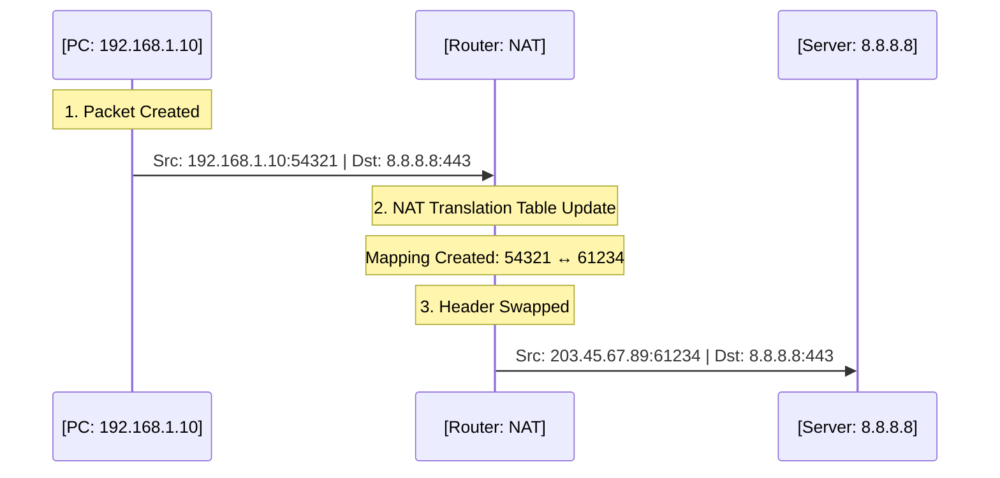
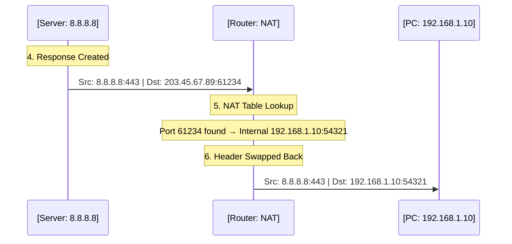

Here's a technical explanation of NAT without analogies:

---

## What is NAT (Network Address Translation)?

### The Basic Definition

**NAT is a process performed by routers that modifies IP address and port information in packet headers as traffic passes between networks.**

Specifically, NAT translates between:
- **Private IP addresses** used on your local network (192.168.x.x, 10.x.x.x, 172.16-31.x.x)
- **Public IP addresses** used on the internet

### Why NAT Exists

**The IPv4 address exhaustion problem:**
- IPv4 provides $2^{32}$ (≈4.3 billion) unique addresses
- With billions of internet-connected devices globally, we've run out of available public IPv4 addresses
- Solution: Multiple devices share a single public IP address using NAT

**Private IP address ranges** (defined in RFC 1918):
```
10.0.0.0        - 10.255.255.255    (16,777,216 addresses)
172.16.0.0      - 172.31.255.255    (1,048,576 addresses)
192.168.0.0     - 192.168.255.255   (65,536 addresses)
```

These addresses are:
- Non-routable on the public internet
- Can be reused by any private network
- Dropped by internet routers if they somehow escape a private network

### What NAT Actually Does to Packets

#### Outbound Traffic (Private → Public)

**Original packet (from your device):**
```text
┌──────────────────────────────────────────────────┐
│             ORIGINAL PACKET (Internal)           │
├───────────────────┬──────────────────────────────┤
│ Source IP         │ 192.168.1.10                 │
│ Source Port       │ 54321                        │
├───────────────────┼──────────────────────────────┤
│ Destination IP    │ 142.250.80.46 (Google)       │
│ Destination Port  │ 443                          │
├───────────────────┴──────────────────────────────┤
│ Payload: [HTTP request data]                     │
└──────────────────────────────────────────────────┘
```

**After NAT translation (leaving router):**
```text
┌──────────────────────────────────────────────────┐
│             NAT PACKET (Leaving Router)          │
├───────────────────┬──────────────────────────────┤
│ Source IP         │ 203.45.67.89 (Public)        │
│ Source Port       │ 61234 (Translated)           │
├───────────────────┼──────────────────────────────┤
│ Destination IP    │ 142.250.80.46 (Google)       │
│ Destination Port  │ 443                          │
├───────────────────┴──────────────────────────────┤
│ Payload: [HTTP request data]                     │
└──────────────────────────────────────────────────┘
```

**NAT operations performed:**
1. Replace source IP with router's public IP
2. Replace source port with a unique port number assigned by the router
3. Create an entry in the NAT translation table
4. Recalculate IP and TCP/UDP checksums
5. Forward the modified packet

#### The NAT Translation Table

The router maintains a state table mapping internal addresses to external ports:

| Internal Address:Port | External Port | Remote Destination  | Protocol | State    | Timeout |
|-----------------------|---------------|---------------------|----------|----------|---------|
| 192.168.1.10:54321    | 61234         | 142.250.80.46:443   | TCP      | ESTAB    | 7200s   |
| 192.168.1.10:54322    | 61235         | 140.82.121.4:443    | TCP      | ESTAB    | 7200s   |
| 192.168.1.11:49152    | 61236         | 8.8.8.8:53          | UDP      | ACTIVE   | 30s     |
| 192.168.1.12:5353     | 61237         | 192.0.2.1:80        | TCP      | SYN_SENT | 120s    |

**Table entry lifecycle:**
- Created when internal device sends outbound packet
- Updated with state changes (TCP handshake, data transfer)
- Removed after timeout period with no activity
  - TCP: typically 2 hours for established connections
  - UDP: typically 30-60 seconds
  - ICMP: typically 30 seconds

#### Inbound Traffic (Public → Private)

**Incoming packet (response from internet):**
```text
┌──────────────────────────────────────────────────┐
│           INCOMING PACKET (From Internet)        │
├───────────────────┬──────────────────────────────┤
│ Source IP         │ 142.250.80.46 (Google)       │
│ Source Port       │ 443                          │
├───────────────────┼──────────────────────────────┤
│ Destination IP    │ 203.45.67.89 (Public)        │
│ Destination Port  │ 61234 (External Port)        │
├───────────────────┴──────────────────────────────┤
│ Payload: [HTTP response data]                    │
└──────────────────────────────────────────────────┘
```

**NAT lookup process:**
1. Router receives packet destined for its public IP
2. Examines destination port (61234)
3. Searches NAT table for matching external port
4. Finds entry: `61234 → 192.168.1.10:54321`
5. Performs reverse translation

**After reverse NAT translation:**
```text
┌──────────────────────────────────────────────────┐
│          TRANSLATED PACKET (To Internal)         │
├───────────────────┬──────────────────────────────┤
│ Source IP         │ 142.250.80.46 (Google)       │
│ Source Port       │ 443                          │
├───────────────────┼──────────────────────────────┤
│ Destination IP    │ 192.168.1.10 (Internal)      │
│ Destination Port  │ 54321 (Original Port)        │
├───────────────────┴──────────────────────────────┤
│ Payload: [HTTP response data]                    │
└──────────────────────────────────────────────────┘
```

**NAT operations performed:**
1. Replace destination IP with original internal IP
2. Replace destination port with original internal port
3. Recalculate checksums
4. Forward packet to internal network

### Why Port Numbers Are Essential

**Multiple devices sharing one public IP:**

```
Device A (192.168.1.10) requests YouTube: 192.168.1.10:54321 → 142.250.80.46:443
Device B (192.168.1.11) requests YouTube: 192.168.1.11:49152 → 142.250.80.46:443

Both destinations are identical (same server, same port)
Both appear to come from the same public IP (203.45.67.89)
```

**NAT assigns unique external ports:**
```
Device A: 192.168.1.10:54321 → NAT → 203.45.67.89:61234 → YouTube
Device B: 192.168.1.11:49152 → NAT → 203.45.67.89:61235 → YouTube
```

**When responses arrive:**
```
YouTube → 203.45.67.89:61234 → NAT table lookup → 192.168.1.10:54321 (Device A)
YouTube → 203.45.67.89:61235 → NAT table lookup → 192.168.1.11:49152 (Device B)
```

The external port number is the **only identifier** that allows the router to determine which internal device should receive the response.

### Types of NAT Behavior

#### 1. Full Cone NAT
```
Mapping: 192.168.1.10:5000 ↔ 203.45.67.89:61234

Once created:
- Any external host can send to 203.45.67.89:61234
- All traffic forwarded to 192.168.1.10:5000
- Mapping persists regardless of remote destination
```

#### 2. Restricted Cone NAT
```
Internal device 192.168.1.10:5000 sends to 8.8.8.8:53
Creates mapping: 192.168.1.10:5000 ↔ 203.45.67.89:61234

Allowed inbound:
✅ 8.8.8.8:* → 203.45.67.89:61234 (any port from 8.8.8.8)

Blocked inbound:
❌ 1.1.1.1:* → 203.45.67.89:61234 (different IP)
```

#### 3. Port Restricted Cone NAT
```
Internal device 192.168.1.10:5000 sends to 8.8.8.8:53
Creates mapping: 192.168.1.10:5000 ↔ 203.45.67.89:61234

Allowed inbound:
✅ 8.8.8.8:53 → 203.45.67.89:61234 (exact IP:port match)

Blocked inbound:
❌ 8.8.8.8:80 → 203.45.67.89:61234 (same IP, different port)
❌ 1.1.1.1:53 → 203.45.67.89:61234 (different IP)
```

#### 4. Symmetric NAT
```
Same internal source, different destinations → different external ports

192.168.1.10:5000 → 8.8.8.8:53    NAT assigns external port 61234
192.168.1.10:5000 → 1.1.1.1:53    NAT assigns external port 61235

Each unique (internal_ip:port, remote_ip:port) tuple gets a unique external port
```

### The Unsolicited Inbound Connection Problem

**What happens when an external host tries to initiate a connection:**

```
Step 1: External host (1.2.3.4) sends packet to your public IP
        Source: 1.2.3.4:12345
        Destination: 203.45.67.89:5000

Step 2: Router receives packet on public interface

Step 3: Router searches NAT table for external port 5000
        Result: No entry found

Step 4: Router has no forwarding rule for this traffic
        
Step 5: Packet dropped (discarded)
```

**Why the packet is dropped:**
- NAT table entries only exist for connections initiated from inside
- Router has no mapping for port 5000 → internal device
- Even if there's only one internal device, the router doesn't forward unmapped ports
- This behavior is by design (security feature + ambiguity prevention)

**The fundamental issue:**
- Outbound-initiated traffic: NAT table entry exists → translation works
- Inbound-initiated traffic: No NAT table entry → no destination → dropped

### NAT and Connection State

**TCP connection tracking:**
```
Outbound SYN:    192.168.1.10:54321 → 8.8.8.8:443
  NAT creates:   Entry in SYN_SENT state
  
Inbound SYN-ACK: 8.8.8.8:443 → 203.45.67.89:61234
  NAT updates:   Entry to ESTABLISHED state
  
Subsequent:      Bidirectional traffic allowed
  NAT tracks:    Packet counts, last activity time
  
Connection close or timeout:
  NAT removes:   Table entry deleted
```

**UDP (connectionless) tracking:**
```
Outbound packet: 192.168.1.10:54321 → 8.8.8.8:53
  NAT creates:   Entry with short timeout (30-60s)
  
Inbound packet:  8.8.8.8:53 → 203.45.67.89:61234
  NAT refreshes: Timeout reset
  
No activity:     Entry expires after timeout
```

### What NAT Does NOT Do

❌ **Does not provide real security**
- Not a firewall (though often combined with stateful firewall)
- Blocking unsolicited inbound is a side effect, not a security feature
- Internal devices can still be compromised through outbound connections

❌ **Does not allow inbound connections by default**
- Requires manual configuration (port forwarding, UPnP)
- Or NAT traversal techniques (STUN, TURN, ICE)

❌ **Does not handle all protocols seamlessly**
- Protocols that embed IP addresses in payload (FTP, SIP) require ALG (Application Layer Gateway)
- IPsec and other VPN protocols can break without special handling
- Some peer-to-peer protocols require additional traversal techniques

❌ **Does not make internal topology visible**
- External hosts see only the public IP
- Cannot determine how many devices are behind NAT
- Cannot distinguish between different internal devices (except by behavior analysis)

### Visual Summary: Complete NAT Packet Flow

To make this crystal clear, we'll look at the "Request" and "Response" as two separate flows.

#### 1. Outbound Flow (Request)
*Your device sends a request to the internet.*



**What the packet looks like during Outbound:**

| Stage | Source IP:Port | Destination IP:Port | Action |
| :--- | :--- | :--- | :--- |
| **Inside LAN** | `192.168.1.10:54321` | `8.8.8.8:443` | Packet sent to gateway |
| **At Router** | `203.45.67.89:61234` | `8.8.8.8:443` | **Source IP/Port swapped** |

---

#### 2. Inbound Flow (Response)
*The server sends data back to you.*



**What the packet looks like during Inbound:**

| Stage | Source IP:Port | Destination IP:Port | Action |
| :--- | :--- | :--- | :--- |
| **Leaving Server** | `8.8.8.8:443` | `203.45.67.89:61234` | Sent to your Public IP |
| **At Router** | `8.8.8.8:443` | `192.168.1.10:54321` | **Dest IP/Port swapped back** |

---

## **How Tailscale Establishes Connections**

Tailscale is a **WireGuard-based mesh VPN** that attempts to establish direct peer-to-peer connections between devices whenever possible, falling back to relay servers when necessary.

### **The Connection Establishment Process**

```
Phase 1: Coordination
    ↓
Phase 2: NAT Type Detection
    ↓
Phase 3: Hole Punching Attempts
    ↓
Phase 4: Fallback to Relay (if necessary)
```

---

### **Phase 1: Coordination via Control Plane**

Every Tailscale client connects to Tailscale's **coordination server** (control plane) over HTTPS (port 443). This server:

1. **Authenticates devices** using your identity provider (Google, GitHub, etc.)
2. **Exchanges network topology** information between peers
3. **Distributes WireGuard public keys** for cryptographic authentication
4. **Shares endpoint information** (public IPs, ports, NAT types)
5. **Provides network policy enforcement** (ACLs, DNS configuration)

**Important:** The coordination server **never sees your actual traffic**—it only facilitates the connection setup. All data transfer is peer-to-peer (or via DERP relays, explained later).

---

### **Phase 2: NAT Type Detection (STUN)**

Tailscale uses **STUN (Session Traversal Utilities for NAT)** servers to help devices discover:

1. **Their public IP address** as seen from the internet
2. **Their external port mapping** created by their NAT router
3. **Their NAT type** (cone, symmetric, etc.)

**STUN workflow:**

```text
┌────────────────┐                ┌────────────────┐
│    Device A    │                │  STUN Server   │
│  (Private IP)  │                │  (Public IP)   │
└───────┬────────┘                └───────┬────────┘
        │                                 │
        │  1. "What's my public endpoint?"│
        │────────────────────────────────>│
        │                                 │
        │  2. "You are 203.45.67.89:41234"│
        │<────────────────────────────────│
        │                                 │
┌───────┴────────┐                        │
│ Result:        │                        │
│ A knows public │                        │
│ IP & Map Type  │                        │
└────────────────┘                        │
```

This information is shared through Tailscale's coordination server.

---

### **Phase 3: NAT Hole Punching**

**Hole punching** is a technique that exploits NAT behavior to allow direct peer-to-peer connections.

#### **How Hole Punching Works**

**The Concept:**
When an internal device sends an outbound packet, the NAT router creates a temporary mapping (a "hole") in its firewall. If both peers send packets simultaneously to each other's public endpoints, they can create bidirectional holes that allow direct communication.

**Step-by-step process:**

```text
  Device A          Router A          Router B          Device B
(203.45.67.89)       (NAT)             (NAT)        (198.23.45.123)
      │                │                 │                │
      │ T=1: Initial Simultaneous Handshake (Simulated)   │
      │                │                 │                │
      │── UDP Pkt ────>│                 │                │
      │                │── (create hole) │                │
      │                │                 │                │
      │                │                 │<── UDP Pkt ────│
      │                │ (create hole) ──│                │
      │                │                 │                │
      │ T=2: Bidirectional Flow Established               │
      │                │                 │                │
      │<───────────────┴─── (Direct) ────┴───────────────>│
      │                │                 │                │
```

**Key insight:** The initial packets from each side might be dropped, but they create the NAT mappings ("holes"). Subsequent packets flow through these holes because the NAT routers now recognize them as part of established sessions.

#### **Types of Hole Punching**

**1. UDP Hole Punching**
- Most common and reliable
- Tailscale uses WireGuard over UDP
- Works with Cone NAT types
- Stateless protocol makes it ideal

**2. TCP Hole Punching**
- More complex due to TCP's stateful handshake
- Requires precise timing
- Less commonly used by Tailscale

**3. Birthday Paradox Attack (for Symmetric NAT)**
When facing symmetric NAT, Tailscale may attempt to predict port allocation patterns by rapidly sending packets to a range of likely ports, hoping to "catch" the correct mapping.

---

### **Phase 4: Fallback Mechanisms**

When direct peer-to-peer connection fails (symmetric NAT, restrictive firewalls, etc.), Tailscale employs fallback strategies.

---

## **DERP Relays: The Safety Net**

**DERP (Designated Encrypted Relay for Packets)** is Tailscale's custom relay protocol—their fallback mechanism when direct connections aren't possible.

### **What is DERP?**

DERP is a **relay server infrastructure** operated by Tailscale (and optionally self-hosted) that forwards encrypted packets between peers who cannot establish direct connections.

**Critical distinction:** DERP relays **cannot decrypt your traffic**. They only see encrypted WireGuard packets and forward them between peers.

### **How DERP Works**

```text
┌──────────┐          ┌─────────────┐          ┌──────────┐
│ Device A │          │ DERP Relay  │          │ Device B │
└────┬─────┘          └──────┬──────┘          └────┬─────┘
     │                       │                      │
     │ 1. Encrypted Frame    │                      │
     │   (Dest: Key B)       │                      │
     │──────────────────────>│                      │
     │                       │ 2. Forward Frame     │
     │                       │   (Dest: Device B)   │
     │                       │─────────────────────>│
     │                       │                      │
     │                       │ 3. Encrypted Resp    │
     │                       │   (Dest: Key A)      │
     │<──────────────────────│<─────────────────────│
     │                       │                      │
```

**DERP Server's View:**
```
Connection Table:
- Device A (public key: abc123...) → Connected from 203.45.67.89:41234
- Device B (public key: def456...) → Connected from 198.23.45.123:38472

Incoming packet from 203.45.67.89:41234
  Destination public key: def456...
  → Lookup: Device B
  → Forward to: 198.23.45.123:38472
```

### **DERP Protocol Features**

1. **Persistent WebSocket Connections:** Both devices maintain long-lived HTTPS/WebSocket connections to DERP servers
2. **Geographic Distribution:** Tailscale operates DERP relays globally; clients automatically select the closest one
3. **Automatic Failover:** If a DERP relay goes down, clients switch to alternatives
4. **Connection Upgrades:** Even when using DERP, Tailscale continuously attempts direct connection establishment in the background

---

## **Network Configuration: TUN Interface**

To integrate into your operating system's network stack, Tailscale creates a **virtual network interface**.

### **What is TUN?**

**TUN (Network TUNnel)** is a virtual network kernel driver that allows applications to send and receive network packets.

- Operates at the **network layer** (OSI Layer 3)
- Handles **IP packets** only
- Used for routing IP traffic between networks
- **Tailscale uses TUN** because it operates at the IP layer

**How TUN works:**

```text
  Application       Kernel Stack       TUN Interface        Tailscale         Physical NIC
       │                  │                  │                  │                  │
       │ (1) Send Packet  │                  │                  │                  │
       │─────────────────>│                  │                  │                  │
       │                  │                  │                  │                  │
       │                  │ (2) Route to TUN │                  │                  │
       │                  │─────────────────>│                  │                  │
       │                  │                  │                  │                  │
       │                  │                  │ (3) Read IP Pkt  │                  │
       │                  │                  │<─────────────────│                  │
       │                  │                  │                  │                  │
       │                  │                  │                  │ (4) Encrypt &    │
       │                  │ (5) Send UDP Packet (via Socket)    │     Wrap in UDP  │
       │                  │<────────────────────────────────────│                  │
       │                  │                  │                  │                  │
       │                  │ (6) Forward to Internet             │                  │
       │                  │───────────────────────────────────────────────────────>│
       │                  │                  │                  │                  │
```

**Example:**
When you access `100.64.0.2` (a Tailscale IP):
1. Kernel routing table directs traffic to `tailscale0` interface
2. Tailscale process reads the IP packet from TUN
3. Encrypts it with WireGuard
4. Sends encrypted packet to peer (directly or via DERP)

---


## **Routing Tables and Tailscale**

When Tailscale is active, it modifies your system's routing table to direct traffic for the Tailscale network through the virtual TUN interface.

### **Example Routing Table (Linux)**

**Before Tailscale:**
```bash
$ ip route show
default via 192.168.1.1 dev eth0 
192.168.1.0/24 dev eth0 proto kernel scope link src 192.168.1.10
```

**After Tailscale starts:**
```bash
$ ip route show
default via 192.168.1.1 dev eth0 
192.168.1.0/24 dev eth0 proto kernel scope link src 192.168.1.10
100.64.0.0/10 dev tailscale0 scope link       ← Tailscale's CGNAT range
100.100.100.100/32 dev tailscale0 scope link  ← Example: Specific peer
```

**What this means:**
- Traffic to `192.168.1.x` → Goes through physical interface (`eth0`)
- Traffic to `8.8.8.8` → Goes through default gateway (internet)
- Traffic to `100.100.100.100` → Goes through Tailscale interface (`tailscale0`)

### **Per-Peer /32 Routes**

You'll notice Tailscale adds **/32 routes** (individual host routes) for each peer.

---

## **CIDR Notation and the /32 Significance**

### **Understanding CIDR (Classless Inter-Domain Routing)**

**CIDR notation** expresses IP addresses and subnet masks compactly:

```
192.168.1.0/24
    ↑        ↑
   IP      Prefix length (number of network bits)
```

**Breakdown:**
- `/24` means the first 24 bits are the network portion
- Remaining 8 bits are for host addresses
- This allows 2⁸ = 256 addresses (192.168.1.0 to 192.168.1.255)

**Common CIDR examples:**

| CIDR | Subnet Mask | Number of Hosts | Use Case |
|------|-------------|-----------------|----------|
| `/8` | 255.0.0.0 | 16,777,214 | Huge networks (Class A) |
| `/16` | 255.255.0.0 | 65,534 | Large networks (Class B) |
| `/24` | 255.255.255.0 | 254 | Typical home/office network |
| `/32` | 255.255.255.255 | 1 | **Single host** |

---

### **Why Tailscale Uses /32 Routes**

Tailscale assigns a unique Tailscale IP to each device (e.g., `100.100.100.100`) and adds a **/32 route** for it—meaning the route applies to **exactly one IP address**.

#### **Reason 1: Precise Routing Control**

With /32 routes, Tailscale can route each peer individually:

```bash
100.64.0.5/32 dev tailscale0   → Peer A
100.64.0.8/32 dev tailscale0   → Peer B
100.64.0.12/32 dev tailscale0  → Peer C
```

Each peer has its own routing entry, allowing granular control over:
- **Different connection methods** (direct vs. DERP)
- **Different network paths** (some peers direct, others relayed)
- **Independent MTU settings**
- **Per-peer ACL enforcement**

#### **Reason 2: Security and Isolation**

**ARP Spoofing Prevention:**

In a traditional subnet (e.g., `/24`), devices use **ARP (Address Resolution Protocol)** to discover MAC addresses:

```
Device A: "Who has 192.168.1.50? Tell 192.168.1.10"
Device B (legitimate): "192.168.1.50 is at MAC aa:bb:cc:dd:ee:ff"
Device C (attacker): "192.168.1.50 is at MAC 11:22:33:44:55:66" ← Spoofed!
```

An attacker can impersonate another device by sending fake ARP responses.

**With /32 routes, there's no ARP:**

Since each peer has a dedicated /32 route pointing directly to the TUN interface, there's no broadcast domain and no ARP resolution needed:

```
Kernel sees packet destined for 100.64.0.5
    ↓
Routing table: "100.64.0.5/32 → tailscale0"
    ↓
Packet goes directly to TUN interface
    ↓
Tailscale encrypts and sends to correct peer using WireGuard public key
```

**WireGuard cryptographic identity** ensures only the legitimate peer (with the matching private key) can decrypt the traffic. No MAC address spoofing possible.

#### **Reason 3: No Broadcast Traffic**

Traditional subnets generate broadcast and multicast traffic (ARP, DHCP, mDNS). With individual /32 routes:
- **No broadcast domain** exists across Tailscale peers
- **Reduces network noise** and improves efficiency
- **Prevents broadcast storms** in large mesh networks

#### **Reason 4: Simplified Network Design**

Each device is treated as a **point-to-point link**, simplifying:
- Routing logic (no subnet calculations)
- Firewall rules (per-peer, not per-subnet)
- Network troubleshooting (clear 1:1 mapping)

---

## **Complete Connection Flow Example**

Let's trace a complete connection between Device A and Device B:

### **Initial Setup**

```text
┌──────────────┐                       ┌──────────────┐
│    Site A    │                       │    Site B    │
│  [Device A]  │                       │  [Device B]  │
└──────┬───────┘                       └──────┬───────┘
       │                                      │
┌──────┴───────┐                       ┌──────┴───────┐
│   Router A   │                       │   Router B   │
└──────┬───────┘                       └──────┬───────┘
       │               ┌─────────┐            │
       └───────────────┤ INTERNET ├────────────┘
                       └─────────┘
```

---

### **Step-by-Step Connection**

**1. Startup and Registration**

Both devices start Tailscale:
```bash
# Device A
sudo tailscale up

# Device B
sudo tailscale up
```

Each device:
- Creates TUN interface (`tailscale0`)
- Connects to coordination server via HTTPS
- Authenticates with identity provider
- Receives WireGuard keys for all authorized peers
- Adds /32 routes for each peer

---

**2. Coordination and Discovery**

```text
┌──────────┐          ┌──────────────┐          ┌──────────┐
│ Device A │          │ Coordination │          │ Device B │
└────┬─────┘          │    Server    │          └────┬─────┘
     │                └──────┬───────┘               │
     │  "I'm A,              │                       │
     │   Key: abc1"          │                       │
     │──────────────────────>│                       │
     │                       │  "I'm B,              │
     │                       │   Key: def4"          │
     │                       │<──────────────────────│
     │                       │                       │
     │      Matchmaker!      │                       │
     │<──────────────────────│──────────────────────>│
     │ "B is at 198.x.y.z"   │ "A is at 203.x.y.z"   │
```

---

**3. STUN and NAT Detection**

Both devices query STUN servers:

```
Device A queries Tailscale's STUN:
Request: "What's my public endpoint?"
Response: "You're 203.45.67.89:41254"
NAT type detected: Port-Restricted Cone

Device B queries STUN:
Request: "What's my public endpoint?"
Response: "You're 198.23.45.123:41641"
NAT type detected: Port-Restricted Cone
```

---

**4. Simultaneous UDP Hole Punching**

Coordination server orchestrates simultaneous packet sending:

```
Time T=0:
Coordination → Device A: "Send to 198.23.45.123:41641 NOW"
Coordination → Device B: "Send to 203.45.67.89:41254 NOW"

Time T=0.001:
Device A: Sends WireGuard handshake → 198.23.45.123:41641
  Router A creates mapping: 192.168.1.10:41254 ↔ 203.45.67.89:41254
  
Device B: Sends WireGuard handshake → 203.45.67.89:41254
  Router B creates mapping: 10.0.0.8:41641 ↔ 198.23.45.123:41641

Time T=0.05:
Device A receives Device B's packet (Router A forwards it)
Device B receives Device A's packet (Router B forwards it)

Time T=0.1:
WireGuard handshake completes
Direct peer-to-peer connection established! ✓
```

---

**5. Data Transfer (Direct Connection)**

Now Device A wants to ping Device B:

```bash
# Device A
ping 100.64.0.12
```

**Packet journey:**

```text
┌─────────┐      ┌─────────┐      ┌───────────┐      ┌─────────┐
│   App   │      │ OS/TUN  │      │ Tailscale │      │ Network │
└────┬────┘      └────┬────┘      └─────┬─────┘      └────┬────┘
     │                │                 │                 │
     │ ICMP Request   │                 │                 │
     │───────────────>│                 │                 │
     │                │ Raw Packet      │                 │
     │                │────────────────>│                 │
     │                │                 │ Encrypt & Send  │
     │                │                 │────────────────>│
     │                │                 │                 │
     │                │                 │ Encrypted Resp  │
     │                │                 │<────────────────│
     │                │ Decrypt & Push  │                 │
     │                │<────────────────│                 │
     │ ICMP Reply     │                 │                 │
     │<───────────────│                 │                 │
```

**Result:** Direct, encrypted, peer-to-peer communication despite both devices being behind NAT.

---

**6. Fallback to DERP (if hole punching fails)**

If connection fails (e.g., symmetric NAT on both sides):

```
Device A → DERP Server (derp1.tailscale.com):
Establishes WebSocket: wss://derp1.tailscale.com:443
"I'm Device A (public key abc123...), ready to receive"

Device B → Same DERP Server:
Establishes WebSocket: wss://derp1.tailscale.com:443
"I'm Device B (public key def456...), ready to receive"

DERP Server connection table:
abc123... (Device A) → WebSocket connection #1
def456... (Device B) → WebSocket connection #2

Device A sends ping to 100.64.0.12:
1. Tailscale encrypts with WireGuard (destination public key: def456...)
2. Sends to DERP via WebSocket with metadata:
   "Forward to: def456..."
3. DERP receives encrypted packet
   Cannot decrypt (doesn't have private keys)
   Looks up def456... in connection table
   Forwards via WebSocket connection #2
4. Device B receives packet from DERP
   Decrypts with WireGuard
   Delivers to kernel via TUN

Ping succeeds via relay! ✓
(With ~20-50ms additional latency depending on DERP location)

Background: Tailscale continues attempting direct connection
If NAT type changes or firewall rules relax, automatically upgrades to direct
```

---

## **Advanced Considerations**

### **MTU (Maximum Transmission Unit)**

Tailscale automatically handles MTU discovery:
- Physical interface MTU (typically 1500 bytes for Ethernet)
- Subtract overhead: IP header (20) + UDP header (8) + WireGuard header (32)
- Tailscale TUN MTU: typically 1280-1420 bytes

### **KeepAlive Packets**

To prevent NAT timeouts, WireGuard sends periodic keepalive packets (every 25 seconds by default) through established connections.

### **Connection Migration**

If your network changes (Wi-Fi → cellular, different Wi-Fi network):
- Tailscale detects new local IP
- Re-runs STUN to discover new public endpoint
- Updates coordination server
- Re-establishes connections with peers
- Seamless handoff with minimal interruption

### **MagicDNS**

Tailscale includes DNS service:
- Each device gets a hostname: `device-a.tailnet-name.ts.net`
- Resolves to Tailscale IP: `100.64.0.5`
- Simplifies addressing (use names instead of IPs)

---

## **Summary: Why Tailscale is Effective**

| Challenge | Tailscale Solution |
|-----------|-------------------|
| **NAT prevents direct connection** | UDP hole punching + STUN coordination |
| **Symmetric NAT blocks hole punching** | DERP relay fallback |
| **Need encryption** | WireGuard with public key cryptography |
| **Complex routing** | TUN interface + /32 routes per peer |
| **Discovery problem** | Central coordination server |
| **Network changes** | Automatic re-negotiation and migration |
| **ARP spoofing** | No ARP (point-to-point /32 routes) |
| **Performance overhead** | WireGuard with minimal latency |
| **Cross-platform** | Portable codebase |

Tailscale orchestrates a sophisticated dance of NAT traversal techniques, cryptographic authentication, and intelligent fallbacks to create the illusion of a simple, flat network—even when devices are scattered across restrictive networks worldwide.

