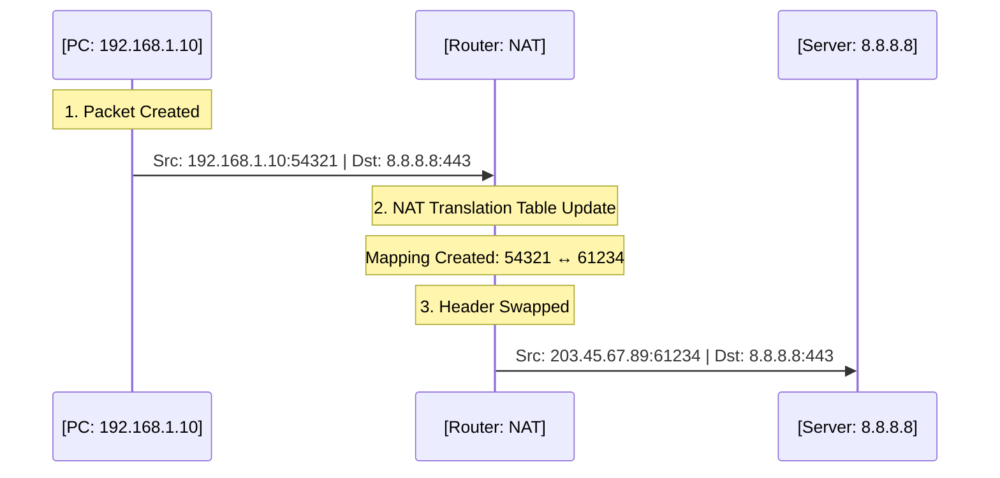
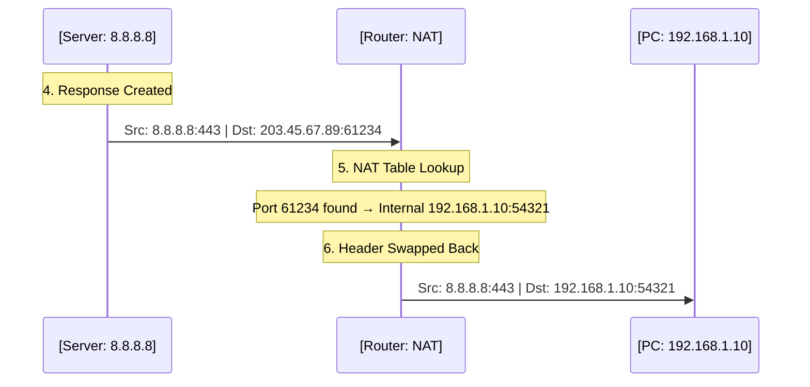

Here's a technical explanation of NAT without analogies:

---

## What is NAT (Network Address Translation)?

### The Basic Definition

**NAT is a process performed by routers that modifies IP address and port information in packet headers as traffic passes between networks.**

Specifically, NAT translates between:
- **Private IP addresses** used on your local network (192.168.x.x, 10.x.x.x, 172.16-31.x.x)
- **Public IP addresses** used on the internet

### Why NAT Exists

**The IPv4 address exhaustion problem:**
- IPv4 provides $2^{32}$ (≈4.3 billion) unique addresses
- With billions of internet-connected devices globally, we've run out of available public IPv4 addresses
- Solution: Multiple devices share a single public IP address using NAT

**Private IP address ranges** (defined in RFC 1918):
```
10.0.0.0        - 10.255.255.255    (16,777,216 addresses)
172.16.0.0      - 172.31.255.255    (1,048,576 addresses)
192.168.0.0     - 192.168.255.255   (65,536 addresses)
```

These addresses are:
- Non-routable on the public internet
- Can be reused by any private network
- Dropped by internet routers if they somehow escape a private network

### What NAT Actually Does to Packets

#### Outbound Traffic (Private → Public)

**Original packet (from your device):**
```text
┌──────────────────────────────────────────────────┐
│             ORIGINAL PACKET (Internal)           │
├───────────────────┬──────────────────────────────┤
│ Source IP         │ 192.168.1.10                 │
│ Source Port       │ 54321                        │
├───────────────────┼──────────────────────────────┤
│ Destination IP    │ 142.250.80.46 (Google)       │
│ Destination Port  │ 443                          │
├───────────────────┴──────────────────────────────┤
│ Payload: [HTTP request data]                     │
└──────────────────────────────────────────────────┘
```

**After NAT translation (leaving router):**
```text
┌──────────────────────────────────────────────────┐
│             NAT PACKET (Leaving Router)          │
├───────────────────┬──────────────────────────────┤
│ Source IP         │ 203.45.67.89 (Public)        │
│ Source Port       │ 61234 (Translated)           │
├───────────────────┼──────────────────────────────┤
│ Destination IP    │ 142.250.80.46 (Google)       │
│ Destination Port  │ 443                          │
├───────────────────┴──────────────────────────────┤
│ Payload: [HTTP request data]                     │
└──────────────────────────────────────────────────┘
```

**NAT operations performed:**
1. Replace source IP with router's public IP
2. Replace source port with a unique port number assigned by the router
3. Create an entry in the NAT translation table
4. Recalculate IP and TCP/UDP checksums
5. Forward the modified packet

#### The NAT Translation Table

The router maintains a state table mapping internal addresses to external ports:

| Internal Address:Port | External Port | Remote Destination  | Protocol | State    | Timeout |
|-----------------------|---------------|---------------------|----------|----------|---------|
| 192.168.1.10:54321    | 61234         | 142.250.80.46:443   | TCP      | ESTAB    | 7200s   |
| 192.168.1.10:54322    | 61235         | 140.82.121.4:443    | TCP      | ESTAB    | 7200s   |
| 192.168.1.11:49152    | 61236         | 8.8.8.8:53          | UDP      | ACTIVE   | 30s     |
| 192.168.1.12:5353     | 61237         | 192.0.2.1:80        | TCP      | SYN_SENT | 120s    |

**Table entry lifecycle:**
- Created when internal device sends outbound packet
- Updated with state changes (TCP handshake, data transfer)
- Removed after timeout period with no activity
  - TCP: typically 2 hours for established connections
  - UDP: typically 30-60 seconds
  - ICMP: typically 30 seconds

#### Inbound Traffic (Public → Private)

**Incoming packet (response from internet):**
```text
┌──────────────────────────────────────────────────┐
│           INCOMING PACKET (From Internet)        │
├───────────────────┬──────────────────────────────┤
│ Source IP         │ 142.250.80.46 (Google)       │
│ Source Port       │ 443                          │
├───────────────────┼──────────────────────────────┤
│ Destination IP    │ 203.45.67.89 (Public)        │
│ Destination Port  │ 61234 (External Port)        │
├───────────────────┴──────────────────────────────┤
│ Payload: [HTTP response data]                    │
└──────────────────────────────────────────────────┘
```

**NAT lookup process:**
1. Router receives packet destined for its public IP
2. Examines destination port (61234)
3. Searches NAT table for matching external port
4. Finds entry: `61234 → 192.168.1.10:54321`
5. Performs reverse translation

**After reverse NAT translation:**
```text
┌──────────────────────────────────────────────────┐
│          TRANSLATED PACKET (To Internal)         │
├───────────────────┬──────────────────────────────┤
│ Source IP         │ 142.250.80.46 (Google)       │
│ Source Port       │ 443                          │
├───────────────────┼──────────────────────────────┤
│ Destination IP    │ 192.168.1.10 (Internal)      │
│ Destination Port  │ 54321 (Original Port)        │
├───────────────────┴──────────────────────────────┤
│ Payload: [HTTP response data]                    │
└──────────────────────────────────────────────────┘
```

**NAT operations performed:**
1. Replace destination IP with original internal IP
2. Replace destination port with original internal port
3. Recalculate checksums
4. Forward packet to internal network


### Types of NAT Behavior

#### 1. Full Cone NAT
```
Mapping: 192.168.1.10:5000 ↔ 203.45.67.89:61234

Once created:
- Any external host can send to 203.45.67.89:61234
- All traffic forwarded to 192.168.1.10:5000
- Mapping persists regardless of remote destination
```

#### 2. Restricted Cone NAT
```
Internal device 192.168.1.10:5000 sends to 8.8.8.8:53
Creates mapping: 192.168.1.10:5000 ↔ 203.45.67.89:61234

Allowed inbound:
✅ 8.8.8.8:* → 203.45.67.89:61234 (any port from 8.8.8.8)

Blocked inbound:
❌ 1.1.1.1:* → 203.45.67.89:61234 (different IP)
```

#### 3. Port Restricted Cone NAT
```
Internal device 192.168.1.10:5000 sends to 8.8.8.8:53
Creates mapping: 192.168.1.10:5000 ↔ 203.45.67.89:61234

Allowed inbound:
✅ 8.8.8.8:53 → 203.45.67.89:61234 (exact IP:port match)

Blocked inbound:
❌ 8.8.8.8:80 → 203.45.67.89:61234 (same IP, different port)
❌ 1.1.1.1:53 → 203.45.67.89:61234 (different IP)
```

#### 4. Symmetric NAT
```
Same internal source, different destinations → different external ports

192.168.1.10:5000 → 8.8.8.8:53    NAT assigns external port 61234
192.168.1.10:5000 → 1.1.1.1:53    NAT assigns external port 61235

Each unique (internal_ip:port, remote_ip:port) tuple gets a unique external port
```

### The Unsolicited Inbound Connection Problem

**What happens when an external host tries to initiate a connection:**

```
Step 1: External host (1.2.3.4) sends packet to your public IP
        Source: 1.2.3.4:12345
        Destination: 203.45.67.89:5000

Step 2: Router receives packet on public interface

Step 3: Router searches NAT table for external port 5000
        Result: No entry found

Step 4: Router has no forwarding rule for this traffic
        
Step 5: Packet dropped (discarded)
```

**Why the packet is dropped:**
- NAT table entries only exist for connections initiated from inside
- Router has no mapping for port 5000 → internal device
- Even if there's only one internal device, the router doesn't forward unmapped ports
- This behavior is by design (security feature + ambiguity prevention)

**The fundamental issue:**
- Outbound-initiated traffic: NAT table entry exists → translation works
- Inbound-initiated traffic: No NAT table entry → no destination → dropped

### NAT Deep Dive and Connection State

To understand NAT fully, we must understand the environment it operates in:
- **Private IP Ranges (RFC 1918)**: Ranges like `10.0.0.0/8`, `172.16.0.0/12`, and `192.168.0.0/16` are designated exclusively for local, private networks. These addresses are **non-routable** on the public internet; if any packet with a private source or destination escapes onto public lines, backbone routers drop it immediately.
- **The IPv4 Exhaustion Problem**: IPv4 provides only $2^{32}$ (~4.3 billion) unique addresses. With tens of billions of internet-connected devices globally, public IPv4 addresses ran out long ago. NAT was introduced to solve this by allowing thousands of devices on local networks to share a single public IP.
- **The Routable vs. Non-Routable Distinction**: A routable IP address is one that can be directly addressed and reached by other hosts on the same network segment. For example, your PC's IP (`192.168.1.10`) is routable to other devices in your home, and an AWS EC2 instance's IP is routable within its Virtual Private Cloud (VPC). However, internal container IPs (`172.17.0.x`) or isolated VM interfaces are non-routable outside their specific hypervisor hosts.

#### The Stateful NAT Barrier
NAT functions as a stateful boundary. It allows internal devices to initiate outbound connections seamlessly because the router automatically records each outgoing session. However, it completely blocks unsolicited **inbound-initiated** connections because the router's public interface receives packets with no corresponding entry in the translation table. The router has no way to determine which private, internal device should receive the packet, and therefore discards it.

#### CGNAT (Carrier-Grade NAT) and Double NAT
In many modern residential networks, ISPs implement **Carrier-Grade NAT (CGNAT)** (also known as Large-Scale NAT). In a CGNAT setup, the ISP does not assign a unique public IP to your router. Instead, the ISP puts you behind their own massive NAT gateway, assigning your router a private IP from the `100.64.0.0/10` CGNAT address space.
This creates a **Double NAT** environment:
1. **First NAT (Your Router)**: Translates local private IPs (`192.168.1.x`) to the ISP-provided private IP (`100.64.x.x`).
2. **Second NAT (ISP Gateway)**: Translates the `100.64.x.x` address to a shared public IP (`203.45.67.89`).

In a Double NAT environment, direct peer-to-peer (P2P) connections become exceptionally difficult. Since you do not control the ISP's NAT, port forwarding on your personal router is completely useless. Unsolicited incoming packets are dropped at the ISP's boundary before they can even reach your network. Under CGNAT, devices are forced to rely on complex NAT traversal protocols or fallback relays to establish communication.

#### Connection State Tracking Mechanics
The NAT gateway tracks sessions at Layer 4 of the OSI model, maintaining extensive state information depending on the protocol:

**TCP Connection Stateful Tracking:**
TCP is connection-oriented, requiring a stateful three-way handshake (SYN, SYN-ACK, ACK) to establish a session, and maintaining sequence and acknowledgment numbers to guarantee order and reliability. If connection state is lost or split, the session is corrupted and must be reset (RST). The NAT table tracks this transition step-by-step:
```text
Outbound SYN:     192.168.1.10:54321 → 8.8.8.8:443
  NAT Action:     Creates a table entry, maps to public socket (e.g., 203.45.67.89:61234),
                  sets state to SYN_SENT.
  
Inbound SYN-ACK:  8.8.8.8:443 → 203.45.67.89:61234
  NAT Action:     Matches the incoming packet to the existing SYN_SENT entry, 
                  updates state to ESTABLISHED, and translates destination to 192.168.1.10:54321.
  
Subsequent Flow:  Bidirectional traffic is permitted. The NAT tracks TCP sequence/ack numbers,
                  packet counts, and resets the activity timer with each packet.
  
Connection Close: When FIN packets are exchanged or the idle timeout expires (typically 2 hours
                  for established TCP sessions), the NAT table entry is deleted.
```

**UDP (Connectionless) Stateful Tracking:**
UDP is connectionless and stateless. It does not establish sessions, use handshakes, or track packet delivery. To allow bidirectional communication over UDP, the NAT gateway must simulate state by using a timer-based virtual tracking mechanism:
```text
Outbound Packet:  192.168.1.10:54321 → 8.8.8.8:53
  NAT Action:     Creates a temporary table mapping entry (e.g., 203.45.67.89:61235) 
                  with a very short inactivity timeout (typically 30 to 60 seconds).
  
Inbound Packet:   8.8.8.8:53 → 203.45.67.89:61235
  NAT Action:     Permits the incoming packet, translates destination, and refreshes 
                  the short inactivity timer back to its maximum.
  
No Activity:      If no packet matches the mapping within the short timeout window,
                  the NAT table entry immediately expires and is deleted.
```

### What NAT Does NOT Do

❌ **Does not provide real security**
- Not a firewall (though often combined with stateful firewall)
- Blocking unsolicited inbound is a side effect, not a security feature
- Internal devices can still be compromised through outbound connections

❌ **Does not allow inbound connections by default (Without Port Forwarding)**
- Requires manual configuration (Port Forwarding, UPnP) to explicitly map public ports.
- Or modern NAT traversal techniques (STUN, TURN, ICE, hole punching).

### Port Forwarding: Bypassing the NAT Barrier

**Port Forwarding** is a manual configuration rule on a NAT gateway/router that instructs it to forward unsolicited inbound traffic received on a specific public port directly to a designated private IP and port on the internal network.

#### How Port Forwarding Works
When an external device initiates an inbound connection, it addresses the packet to the router's public socket endpoint:
```text
Destination Socket: [Public_IP_Address]:[Configured_External_Port]
```
Under normal NAT conditions, this unsolicited packet would be immediately dropped. However, with an active Port Forwarding rule:
1. The router intercepts the packet on its public interface.
2. It queries its static forwarding table.
3. It finds a matching rule mapping the `External_Port` to an internal `Private_IP:Internal_Port`.
4. It translates the destination IP and port in the packet header to the private values.
5. It recalculates the IP and TCP/UDP checksums.
6. It forwards the modified packet to the internal device.

```text
┌─────────────────────────┐         ┌───────────┐         ┌─────────────────────────┐
│     EXTERNAL CLIENT     │         │   ROUTER  │         │     INTERNAL SERVER     │
│  (Public: 1.2.3.4)      │         │   (NAT)   │         │ (Private: 192.168.1.10) │
└────────────┬────────────┘         └─────┬─────┘         └────────────┬────────────┘
             │                            │                            │
             │ Connect to 203.45.67.89:80 │                            │
             ├───────────────────────────>│                            │
             │                            │ Lookup Static Map:         │
             │                            │ Port 80 -> 192.168.1.10:80 │
             │                            │                            │
             │                            │ Translate and Forward      │
             │                            ├───────────────────────────>│
             │                            │                            │
```

#### Major Limitations and Blockers of Port Forwarding
While highly effective for simple home hosting, port forwarding suffers from severe operational, architectural, and security constraints:
* **Static Mapping / Port Collision Constraint**: A single public port can only map to a single private device. If you have two web servers inside your LAN, they cannot both accept external traffic on port 80 or 443 simultaneously using a single public IP. You must assign them to different, non-standard external ports (e.g., mapping port 80 to Server A, and port 8080 to Server B), causing configuration complexity.
* **Security Exposure and Attack Surface**: Port forwarding bypasses the stateful NAT barrier, exposing the internal device directly to the public internet. Port scanners, bots, and malicious actors can scan open ports, identify vulnerabilities in the running service, and compromise the internal machine.
* **Dynamic Public IPs**: Most consumer ISPs dynamically lease public IP addresses. When the ISP renews the lease, your public IP changes, breaking external access unless you integrate complex Dynamic DNS (DDNS) services to track IP updates.
* **The CGNAT / Double NAT Blocker**: Port forwarding is completely useless if your ISP uses CGNAT or if you are behind a double-NAT environment. Because the upstream NAT gateway (which you do not control) drops the unsolicited inbound packet before it ever reaches your router, opening a port on your local router will not enable external access.

❌ **Does not handle all protocols seamlessly**
- Protocols that embed IP addresses in payload (FTP, SIP) require ALG (Application Layer Gateway)
- IPsec and other VPN protocols can break without special handling
- Some peer-to-peer protocols require additional traversal techniques

❌ **Does not make internal topology visible**
- External hosts see only the public IP
- Cannot determine how many devices are behind NAT
- Cannot distinguish between different internal devices (except by behavior analysis)

### Visual Summary: Complete NAT Packet Flow

To make this crystal clear, we'll look at the "Request" and "Response" as two separate flows.

#### 1. Outbound Flow (Request)
*Your device sends a request to the internet.*



**What the packet looks like during Outbound:**

| Stage | Source IP:Port | Destination IP:Port | Action |
| :--- | :--- | :--- | :--- |
| **Inside LAN** | `192.168.1.10:54321` | `8.8.8.8:443` | Packet sent to gateway |
| **At Router** | `203.45.67.89:61234` | `8.8.8.8:443` | **Source IP/Port swapped** |

---

#### 2. Inbound Flow (Response)
*The server sends data back to you.*



**What the packet looks like during Inbound:**

| Stage | Source IP:Port | Destination IP:Port | Action |
| :--- | :--- | :--- | :--- |
| **Leaving Server** | `8.8.8.8:443` | `203.45.67.89:61234` | Sent to your Public IP |
| **At Router** | `8.8.8.8:443` | `192.168.1.10:54321` | **Dest IP/Port swapped back** |

---

## **Virtual Private Networks (VPNs) and Stateful Firewalls**

### What is a VPN?
A **Virtual Private Network (VPN)** is a technology that constructs an encrypted, secure communication tunnel across an untrusted, public network (like the internet). It allows geographically dispersed hosts to transmit data securely as if they were directly connected to the same flat, physical local area network.

### The Interplay of Firewalls and VPNs
A **firewall** is a network security system that monitors and controls incoming and outgoing network traffic based on predetermined security rules.

* **Stateful Firewall Filtering**: Modern firewalls track the connection state of Layer 4 sessions (like TCP connections). They permit outbound-initiated traffic and dynamically allow corresponding inbound responses, but immediately block unsolicited inbound packets that attempt to initiate a connection from the outside.
* **The Outbound Tunnel Solution**: Traditional and mesh VPNs bypass local stateful firewalls and NAT barriers by initiating a secure **outbound** connection from the client machine to a known public server (such as a VPN gateway, coordination server, or relay node). Because this connection is initiated from the inside, the local firewall and NAT gateway permit the return traffic, establishing a stable, bidirectional tunnel.
* **Software-Defined VPN Firewalls**: Once a VPN tunnel is established, network security is managed at the software level through **Access Control Lists (ACLs)**. In modern mesh VPNs like Tailscale, WireGuard cryptographically signs every packet using public key pairs. This enables the VPN's software-defined firewall to filter traffic based on **cryptographic identity** (public keys) rather than easily spoofed MAC or IP addresses, ensuring that only verified, authorized peers can communicate regardless of physical topology.

---

## **How Tailscale Establishes Connections**

Tailscale is a **WireGuard-based mesh VPN** that attempts to establish direct peer-to-peer connections between devices whenever possible, falling back to relay servers when necessary.

### **The Connection Establishment Process**

```
Phase 1: Coordination
    ↓
Phase 2: NAT Type Detection
    ↓
Phase 3: Hole Punching Attempts
    ↓
Phase 4: Fallback to Relay (if necessary)
```

---

### **Phase 1: Coordination via Control Plane**

Every Tailscale client connects to Tailscale's **coordination server** (control plane) over HTTPS (port 443). This server:

1. **Authenticates devices** using your identity provider (Google, GitHub, etc.)
2. **Exchanges network topology** information between peers
3. **Distributes WireGuard public keys** for cryptographic authentication
4. **Shares endpoint information** (public IPs, ports, NAT types)
5. **Provides network policy enforcement** (ACLs, DNS configuration)

**Important:** The coordination server **never sees your actual traffic**-it only facilitates the connection setup. All data transfer is peer-to-peer (or via DERP relays, explained later).

---

### **Phase 2: NAT Type Detection (STUN) & Coordination**

Tailscale uses **STUN (Session Traversal Utilities for NAT)** servers to help devices discover their external networking profile:
1. **Their Public IP Address**: The WAN IP address assigned by their router or ISP NAT.
2. **Their External Port Mapping**: The translated port assigned by the NAT gateway for outgoing traffic.
3. **Their NAT Mapping Behavior**: Determining if the router behaves as a Cone NAT (which maps internal sockets to a static public port that anyone can send back to) or Symmetric NAT (which assigns a different public port for every remote destination, preventing simple P2P).

#### 1. STUN Discovery Sequence
Each device sends a lightweight UDP query to a public STUN server operated by Tailscale. Because the STUN server resides on the public internet, it sees the post-NAT source IP and port in the UDP header and replies with those exact values.

```text
┌──────────────┐                       ┌──────────────┐
│   Device A   │                       │ STUN Server  │
│ (192.168.1.5)│                       │ (Public IP)  │
└──────┬───────┘                       └──────┬───────┘
       │                                      │
       │ 1. UDP packet: "What is my IP/Port?" │
       ├─────────────────────────────────────>│  (Packet goes through NAT router)
       │                                      │  (Router translates Src to 203.45.67.89:41234)
       │                                      │
       │ 2. UDP response: "You are 203.45.67.89:41234"
       │<─────────────────────────────────────┤
       │                                      │
┌──────┴───────┐                              │
│ Result:      │                              │
│ Device A now │                              │
│ knows public │                              │
│ endpoint!    │                              │
└──────────────┘                              │
```

#### 2. The Coordination Server Exchange (Control Plane)
Once a device discovers its public endpoint and NAT mapping type, it does not broadcast it. Instead, it uploads this metadata securely over HTTPS to Tailscale's central **Coordination Server**.
The coordination server acts as a cryptographic matchmaker, exchanging peer public keys, internal/external IP endpoints, and NAT types among authorized devices in the tailnet.

```text
┌──────────────┐               ┌──────────────┐               ┌──────────────┐
│   Device A   │               │ Coordination │               │   Device B   │
│ (Key: abc12) │               │    Server    │               │ (Key: def45) │
└──────┬───────┘               └──────┬───────┘               └──────┬───────┘
       │                              │                              │
       │ 1. Uploads public endpoint   │                              │
       │    (203.45.67.89:41234)      │                              │
       ├─────────────────────────────>│                              │
       │                              │ 2. Uploads public endpoint   │
       │                              │    (198.23.45.123:38472)     │
       │                              │<─────────────────────────────┤
       │                              │                              │
       │ 3. Downloads Device B info   │                              │
       │    (Key: def45 at public     │                              │
       │     IP 198.23.45.123:38472)   │                              │
       │<─────────────────────────────┤                              │
       │                              │ 4. Downloads Device A info   │
       │                              │    (Key: abc12 at public     │
       │                              │     IP 203.45.67.89:41234)   │
       │                              ├─────────────────────────────>│
```

---

### **Phase 3: NAT Hole Punching**

**Hole punching** is a technique that exploits NAT behavior to allow direct peer-to-peer connections.

#### How Hole Punching Works (Simplified)

Hole punching exploits the core behavior of stateful firewalls and NAT: **unsolicited inbound packets are blocked, but outbound-initiated packets and their responses are allowed.**

When Device A and Device B want to establish a P2P connection, they utilize their exchanged endpoint metadata to execute a coordinated, simultaneous UDP packet exchange:

1. **Device A Sends to Device B**: Device A sends a UDP packet to B's public endpoint (`198.23.45.123:38472`). As this packet traverses Router A, it creates a temporary stateful mapping ("hole") allowing inbound traffic from B's IP to A's public port (`203.45.67.89:41234`). When the packet arrives at Router B, Router B rejects/drops it because B has not yet sent an outbound packet to A.
2. **Device B Sends to Device A**: Simultaneously, Device B sends a UDP packet to A's public endpoint (`203.45.67.89:41234`). As this packet traverses Router B, it creates an outbound stateful mapping allowing inbound traffic from A's IP to B's public port (`198.23.45.123:38472`).
3. **Mappings Converge**: When B's packet arrives at Router A, Router A sees a packet from `198.23.45.123:38472` arriving at port `41234`. Router A queries its active NAT table, sees the stateful mapping created by Device A's outbound packet, recognizes the traffic as a solicited response, and forwards it directly to Device A.
4. **Bidirectional Flow**: Now that A has received B's packet, subsequent packets sent from A to B will pass through Router B's stateful mapping, which was successfully created in Step 2. Direct, peer-to-peer communication is established, bypassing firewalls on both sides!

```text
  Device A              Router A              Router B              Device B
(192.168.1.5)            (NAT)                 (NAT)              (10.0.0.8)
      │                    │                     │                    │
      │ 1. UDP packet to   │                     │                    │
      │    198.23.45.123   │                     │                    │
      ├───────────────────>│                     │                    │
      │                    │ (Create Outbound    │                    │
      │                    │  State Mapping A)   │                    │
      │                    │                     │                    │
      │                    │── [Dropped by B] ──>│                    │
      │                    │                     │                    │
      │                    │                     │ 2. UDP packet to   │
      │                    │                     │    203.45.67.89    │
      │                    │                     │<───────────────────┤
      │                    │                     │ (Create Outbound   │
      │                    │                     │  State Mapping B)  │
      │                    │                     │                    │
      │                    │<─── [Matches A] ────│                    │
      │<───────────────────┤                     │                    │
      │                    │                     │                    │
      │ 3. P2P established │                     │                    │
      │<───────────────────┴────── (Direct) ─────┴───────────────────>│
```

#### Types of Hole Punching and Symmetric NAT Blockers

* **UDP Hole Punching**: The most common and reliable method. Because UDP is connectionless and lightweight, stateful firewall rules are simple (timeout-based) and do not enforce handshake state checks. It is highly compatible with Cone NAT systems.
* **TCP Hole Punching**: Significantly more complex because TCP is connection-oriented. NAT routers verify state transitions (SYN, SYN-ACK, ACK) and sequence numbers. Establishing a connection requires precise synchronization, exploiting the simultaneous-open TCP state transition, which is rarely supported by consumer routers.
* **The Symmetric NAT Blocker (Birthday Paradox Attack)**:
  Under **Symmetric NAT**, the router assigns a *different* public port for every remote endpoint socket.
  - When Device A (behind Symmetric NAT) queries STUN, it gets port `60001`.
  - But when Device A sends a packet to Device B's public IP, Router A assigns a *new* port, e.g., `60002`.
  
  Because the destination port is unpredictable, simple hole punching fails. To bypass this, Tailscale implements a **Birthday Paradox Attack**: Device B floods a wide range of predicted ports on Device A (e.g., sending packets to ports `60000-60500`), hoping to hit the dynamically allocated port assigned by Router A's symmetric translation. If NAT port assignment is completely random, this method fails, requiring a relay server.

---

### **Phase 4: Fallback Mechanisms**

When direct peer-to-peer connection fails (symmetric NAT, restrictive firewalls, etc.), Tailscale employs fallback strategies.

---

## **DERP Relays: The Safety Net**

**DERP (Designated Encrypted Relay for Packets)** is Tailscale's custom relay protocol-their fallback mechanism when direct connections aren't possible.

### **DERP Relays: The Encrypted Safety Net**

When direct peer-to-peer connections are blocked (due to symmetric NAT on both sides, double NAT, or strict corporate firewalls), Tailscale falls back to its custom relay infrastructure: **DERP (Designated Encrypted Relay for Packets)**.

#### Cryptographic Zero-Trust Security of DERP
A critical property of the DERP protocol is that **DERP servers cannot decrypt your traffic.**
Because Tailscale builds a WireGuard secure tunnel end-to-end between the peers, the traffic is encrypted on Device A using Device B's public key before leaving the host. The DERP server acts purely as a Layer 4 packet router. It reads only the unencrypted metadata wrapper containing the destination peer's public key and forwards the encrypted WireGuard payload without being able to view its contents.

#### The WebSocket Communication Path
Standard UDP traffic is often heavily restricted by strict enterprise firewalls. To bypass this, both Tailscale clients establish a secure, outbound HTTPS/WebSocket connection (over standard TCP port 443) to a globally distributed DERP relay server. Because port 443 is universally open for web traffic, firewalls permit these connections.

```text
┌──────────┐          ┌─────────────────────────┐          ┌──────────┐
│ Device A │          │    DERP RELAY SERVER    │          │ Device B │
│ (abc123) │          │  (Port 443 WebSocket)   │          │ (def456) │
└────┬─────┘          └────────────┬────────────┘          └────┬─────┘
     │                             │                            │
     │ 1. Outbound HTTPS/WS        │                            │
     ├────────────────────────────>│                            │
     │    (Connection active)      │ 2. Outbound HTTPS/WS       │
     │                             │<───────────────────────────┤
     │                             │    (Connection active)     │
     │                             │                            │
     │ 3. Sends Encrypted Packet   │                            │
     │    [Dst Key: def456]        │                            │
     ├────────────────────────────>│                            │
     │                             │ 4. Looks up def456 in table│
     │                             │    and forwards packet     │
     │                             ├───────────────────────────>│
     │                             │                            │
     │                             │ 5. Returns Encrypted Resp  │
     │                             │    [Dst Key: abc123]       │
     │                             │<───────────────────────────┤
     │ 6. Forwards response        │                            │
     │<────────────────────────────┤                            │
```

#### DERP Protocol Key Features
1. **End-to-End Cryptographic Isolation**: Routing is based strictly on public keys. The server maintains an internal mapping: `Public_Key ↔ WebSocket_Connection_ID`. No IP address tracking or routing updates are required.
2. **Global Geographic Routing**: Tailscale hosts DERP servers globally (New York, Frankfurt, Tokyo, etc.). Clients continuously measure latency and automatically bind to the closest, lowest-latency relay node.
3. **Persistent WebSocket Channel**: Keeps the stateful firewall entry open indefinitely by sending periodic, lightweight keepalive frames.
4. **Seamless Background Upgrades**: Even while actively routing traffic over DERP, the `tailscaled` daemon continuously attempts to punch direct UDP holes in the background. If a direct P2P connection succeeds, the daemon dynamically updates the routing path to bypass the relay, dropping latency to the absolute minimum without breaking the active connection state.

---

## **Network Configuration: TUN Interface**

To integrate into your operating system's network stack, Tailscale creates a **virtual network interface**.

### Virtual Network Interfaces: TUN vs. TAP

To integrate seamlessly with the operating system's standard network stack, VPNs create virtual network cards. These exist as software-defined interfaces rather than hardware NICs. The two primary virtual interface drivers in Unix/Linux are **TUN** and **TAP**:

* **TUN (Network TUNnel)**:
  - **OSI Layer**: Network Layer (Layer 3).
  - **Payload**: Handles raw **IP packets** only. It does not contain Layer 2 Ethernet headers (MAC addresses).
  - **Topology**: Designed for point-to-point routing.
  - **ARP & Broadcast**: Since there is no Layer 2 context, the interface does not use ARP (Address Resolution Protocol) and completely lacks a broadcast domain.
  
* **TAP (Network TAP)**:
  - **OSI Layer**: Data Link Layer (Layer 2).
  - **Payload**: Handles full **Ethernet frames**, including MAC headers, EtherType, and CRC checksums.
  - **Topology**: Designed to act like a virtual switch, bridging networks.
  - **ARP & Broadcast**: Fully supports ARP queries, DHCP discover broadcasts, and neighbor discovery.

#### Why Tailscale Uses TUN and Not TAP
Tailscale utilizes a Layer 3 TUN interface (`tailscale0`) because it operates on a **cryptographically routed mesh**, not a bridged network.
1. **Elimination of Broadcast Traffic**: Mesh networks containing thousands of hosts would be severely degraded by Layer 2 broadcast storms (ARP sweeps, NetBIOS advertisements). A TUN interface eliminates all broadcast traffic.
2. **Efficiency**: By omitting the 14-byte Ethernet header, TUN reduces packet overhead and maximizes payload space.
3. **No ARP Spoofing Vulnerability**: Since there is no ARP, malicious or compromised peers cannot perform ARP spoofing attacks to hijack traffic. The kernel routes traffic directly to the TUN interface, and WireGuard guarantees it goes strictly to the peer owning the corresponding cryptographic key.

---

### Userspace vs. Kernelspace Networking

To fully understand the architecture of modern VPNs and platforms like WSL2, we must analyze the performance trade-offs of where network processing occurs in memory:

#### The Memory Boundary
* **Kernelspace**: The highly protected, privileged core of the operating system. Code running here (like OS network stacks, drivers, and native kernel modules) has direct, unrestricted access to the hardware and CPU registers.
* **Userspace**: The unprivileged region where normal applications (browsers, text editors, and the `tailscaled` daemon) run. Userspace applications cannot directly access hardware and must request kernel services via **System Calls (Syscalls)**.

#### The Cost of Context Switches
Every time a userspace program communicates with the hardware, the CPU must perform a **Context Switch**. This involves saving the userspace registers and stack pointers, switching the CPU execution ring to privileged mode (Ring 0), executing the kernel operation, switching back, and restoring the program's memory state. Each context switch takes approximately 1 to 5 microseconds. For high-volume packet processing, these context switches introduce massive CPU overhead.

#### Packet Flow Comparison

**1. Kernelspace Native Networking (The Fast Path):**
When running native WireGuard in the Linux kernel, packet processing stays entirely in Ring 0:
```text
[Browser (Userspace)]
       │  (Syscall: send())
───────┼───────────────────────────────── System Call Boundary
       ▼
[Kernel TCP/IP Stack] ──► [Kernel WireGuard Module] ──► [NIC Driver] ──► [Physical Cable]
```
* **Efficiency**: Exactly 1 context switch. No data is copied back and forth between userspace and kernel space. Performance is near wire speed (3 to 5+ Gbps).

**2. Userspace VPN Networking (The Slower Path):**
When running Tailscale in userspace (using `wireguard-go` or `tailscaled` userspace mode), the packet must cross the syscall boundary multiple times:
```text
[Browser (Userspace)]                                 [tailscaled (Userspace)]
       │                                                         ▲  (Reads raw packet from TUN)
       │ (Syscall: send())                                       │  (Encrypts & wraps in UDP)
───────┼─────────────────────────────────────────────────────────┼─────── System Call Boundary
       ▼                                                         │
[Kernel TCP/IP Stack] ──► [TUN Interface (tailscale0)] ──────────┘
                                                                 │
                                                                 ▼  (Syscall: sendto() socket)
───────┼───────────────────────────────────────────────────────────────── System Call Boundary
       ▼
[Kernel UDP/IP Stack] ──► [NIC Driver] ──► [Physical Cable]
```
* **Context Switches**: Requires 3+ context switches per packet (Browser -> Kernel -> Userspace `tailscaled` -> Kernel -> NIC) plus multiple redundant memory copies.
* **Performance Impact**: High CPU usage and lower throughput. Userspace VPN speeds are typically capped between 500 Mbps and 1.5 Gbps. While slower, this is still perfectly adequate for 99% of internet connections.

#### Why Userspace Networking is Necessary
Despite the performance penalty, userspace networking is essential for portability and compatibility:
1. **WSL2 VMs**: Microsoft's custom lightweight Linux kernel in WSL2 does not support loading arbitrary kernel modules and does not compile the WireGuard kernel module by default. Tailscale must run in userspace to function inside WSL2.
2. **Docker Containers**: Containers share the host's kernel and are sandboxed. They do not have permission to load kernel modules or create physical interfaces, requiring userspace engines.
3. **macOS Security Model**: Apple deprecates third-party kernel extensions (KEXTs) for system stability. macOS VPN clients must use userspace system extensions.
4. **Mobile OS Sandboxing (iOS/Android)**: Strict mobile security architectures prohibit running kernel-level drivers, mandating userspace VPN APIs.

---


## **Routing Tables and Tailscale**

When Tailscale is active, it modifies your system's routing table to direct traffic for the Tailscale network through the virtual TUN interface.

### **Example Routing Table (Linux)**

**Before Tailscale:**
```bash
$ ip route show
default via 192.168.1.1 dev eth0 
192.168.1.0/24 dev eth0 proto kernel scope link src 192.168.1.10
```

**After Tailscale starts:**
```bash
$ ip route show
default via 192.168.1.1 dev eth0 
192.168.1.0/24 dev eth0 proto kernel scope link src 192.168.1.10
100.64.0.0/10 dev tailscale0 scope link       ← Tailscale's CGNAT range
100.100.100.100/32 dev tailscale0 scope link  ← Example: Specific peer
```

**What this means:**
- Traffic to `192.168.1.x` → Goes through physical interface (`eth0`)
- Traffic to `8.8.8.8` → Goes through default gateway (internet)
- Traffic to `100.100.100.100` → Goes through Tailscale interface (`tailscale0`)

### **Per-Peer /32 Routes**

You'll notice Tailscale adds **/32 routes** (individual host routes) for each peer.

---

## **CIDR Notation and the /32 Significance**

### **Understanding CIDR (Classless Inter-Domain Routing)**

**CIDR notation** expresses IP addresses and subnet masks compactly:

```
192.168.1.0/24
    ↑        ↑
   IP      Prefix length (number of network bits)
```

**Breakdown:**
- `/24` means the first 24 bits are the network portion
- Remaining 8 bits are for host addresses
- This allows 2⁸ = 256 addresses (192.168.1.0 to 192.168.1.255)

**Common CIDR examples:**

| CIDR | Subnet Mask | Number of Hosts | Use Case |
|------|-------------|-----------------|----------|
| `/8` | 255.0.0.0 | 16,777,214 | Huge networks (Class A) |
| `/16` | 255.255.0.0 | 65,534 | Large networks (Class B) |
| `/24` | 255.255.255.0 | 254 | Typical home/office network |
| `/32` | 255.255.255.255 | 1 | **Single host** |

---

### **Why Tailscale Uses /32 Routes**

Tailscale assigns a unique Tailscale IP to each device (e.g., `100.100.100.100`) and adds a **/32 route** for it-meaning the route applies to **exactly one IP address**.

#### **Reason 1: Precise Routing Control**

With /32 routes, Tailscale can route each peer individually:

```bash
100.64.0.5/32 dev tailscale0   → Peer A
100.64.0.8/32 dev tailscale0   → Peer B
100.64.0.12/32 dev tailscale0  → Peer C
```

Each peer has its own routing entry, allowing granular control over:
- **Different connection methods** (direct vs. DERP)
- **Different network paths** (some peers direct, others relayed)
- **Independent MTU settings**
- **Per-peer ACL enforcement**

#### **Reason 2: Security and Isolation**

**ARP Spoofing Prevention:**

In a traditional subnet (e.g., `/24`), devices use **ARP (Address Resolution Protocol)** to discover MAC addresses:

```
Device A: "Who has 192.168.1.50? Tell 192.168.1.10"
Device B (legitimate): "192.168.1.50 is at MAC aa:bb:cc:dd:ee:ff"
Device C (attacker): "192.168.1.50 is at MAC 11:22:33:44:55:66" ← Spoofed!
```

An attacker can impersonate another device by sending fake ARP responses.

**With /32 routes, there's no ARP:**

Since each peer has a dedicated /32 route pointing directly to the TUN interface, there's no broadcast domain and no ARP resolution needed:

```
Kernel sees packet destined for 100.64.0.5
    ↓
Routing table: "100.64.0.5/32 → tailscale0"
    ↓
Packet goes directly to TUN interface
    ↓
Tailscale encrypts and sends to correct peer using WireGuard public key
```

**WireGuard cryptographic identity** ensures only the legitimate peer (with the matching private key) can decrypt the traffic. No MAC address spoofing possible.

#### **Reason 3: No Broadcast Traffic**

Traditional subnets generate broadcast and multicast traffic (ARP, DHCP, mDNS). With individual /32 routes:
- **No broadcast domain** exists across Tailscale peers
- **Reduces network noise** and improves efficiency
- **Prevents broadcast storms** in large mesh networks

#### **Reason 4: Simplified Network Design**

Each device is treated as a **point-to-point link**, simplifying:
- Routing logic (no subnet calculations)
- Firewall rules (per-peer, not per-subnet)
- Network troubleshooting (clear 1:1 mapping)

---

## **Complete Connection Flow Example**

Let's trace a complete connection between Device A and Device B:

### **Initial Setup**

```text
┌──────────────┐                       ┌──────────────┐
│    Site A    │                       │    Site B    │
│  [Device A]  │                       │  [Device B]  │
└──────┬───────┘                       └──────┬───────┘
       │                                      │
┌──────┴───────┐                       ┌──────┴───────┐
│   Router A   │                       │   Router B   │
└──────┬───────┘                       └──────┬───────┘
       │               ┌─────────┐            │
       └───────────────┤ INTERNET ├────────────┘
                       └─────────┘
```

---

### **Step-by-Step Connection**

**1. Startup and Registration**

Both devices start Tailscale:
```bash
# Device A
sudo tailscale up

# Device B
sudo tailscale up
```

Each device:
- Creates TUN interface (`tailscale0`)
- Connects to coordination server via HTTPS
- Authenticates with identity provider
- Receives WireGuard keys for all authorized peers
- Adds /32 routes for each peer

---

**2. Coordination and Discovery**

```text
┌──────────┐          ┌──────────────┐          ┌──────────┐
│ Device A │          │ Coordination │          │ Device B │
└────┬─────┘          │    Server    │          └────┬─────┘
     │                └──────┬───────┘               │
     │  "I'm A,              │                       │
     │   Key: abc1"          │                       │
     │──────────────────────>│                       │
     │                       │  "I'm B,              │
     │                       │   Key: def4"          │
     │                       │<──────────────────────│
     │                       │                       │
     │      Matchmaker!      │                       │
     │<──────────────────────│──────────────────────>│
     │ "B is at 198.x.y.z"   │ "A is at 203.x.y.z"   │
```

---

**3. STUN and NAT Detection**

Both devices query STUN servers:

```
Device A queries Tailscale's STUN:
Request: "What's my public endpoint?"
Response: "You're 203.45.67.89:41254"
NAT type detected: Port-Restricted Cone

Device B queries STUN:
Request: "What's my public endpoint?"
Response: "You're 198.23.45.123:41641"
NAT type detected: Port-Restricted Cone
```

---

**4. Simultaneous UDP Hole Punching**

Coordination server orchestrates simultaneous packet sending:

```
Time T=0:
Coordination → Device A: "Send to 198.23.45.123:41641 NOW"
Coordination → Device B: "Send to 203.45.67.89:41254 NOW"

Time T=0.001:
Device A: Sends WireGuard handshake → 198.23.45.123:41641
  Router A creates mapping: 192.168.1.10:41254 ↔ 203.45.67.89:41254
  
Device B: Sends WireGuard handshake → 203.45.67.89:41254
  Router B creates mapping: 10.0.0.8:41641 ↔ 198.23.45.123:41641

Time T=0.05:
Device A receives Device B's packet (Router A forwards it)
Device B receives Device A's packet (Router B forwards it)

Time T=0.1:
WireGuard handshake completes
Direct peer-to-peer connection established! ✓
```

---

**5. Data Transfer (Direct Connection)**

Now Device A wants to ping Device B:

```bash
# Device A
ping 100.64.0.12
```

**Packet journey:**

```text
┌─────────┐      ┌─────────┐      ┌───────────┐      ┌─────────┐
│   App   │      │ OS/TUN  │      │ Tailscale │      │ Network │
└────┬────┘      └────┬────┘      └─────┬─────┘      └────┬────┘
     │                │                 │                 │
     │ ICMP Request   │                 │                 │
     │───────────────>│                 │                 │
     │                │ Raw Packet      │                 │
     │                │────────────────>│                 │
     │                │                 │ Encrypt & Send  │
     │                │                 │────────────────>│
     │                │                 │                 │
     │                │                 │ Encrypted Resp  │
     │                │                 │<────────────────│
     │                │ Decrypt & Push  │                 │
     │                │<────────────────│                 │
     │ ICMP Reply     │                 │                 │
     │<───────────────│                 │                 │
```

**Result:** Direct, encrypted, peer-to-peer communication despite both devices being behind NAT.

---

**6. Fallback to DERP (if hole punching fails)**

If connection fails (e.g., symmetric NAT on both sides):

```
Device A → DERP Server (derp1.tailscale.com):
Establishes WebSocket: wss://derp1.tailscale.com:443
"I'm Device A (public key abc123...), ready to receive"

Device B → Same DERP Server:
Establishes WebSocket: wss://derp1.tailscale.com:443
"I'm Device B (public key def456...), ready to receive"

DERP Server connection table:
abc123... (Device A) → WebSocket connection #1
def456... (Device B) → WebSocket connection #2

Device A sends ping to 100.64.0.12:
1. Tailscale encrypts with WireGuard (destination public key: def456...)
2. Sends to DERP via WebSocket with metadata:
   "Forward to: def456..."
3. DERP receives encrypted packet
   Cannot decrypt (doesn't have private keys)
   Looks up def456... in connection table
   Forwards via WebSocket connection #2
4. Device B receives packet from DERP
   Decrypts with WireGuard
   Delivers to kernel via TUN

Ping succeeds via relay! ✓
(With ~20-50ms additional latency depending on DERP location)

Background: Tailscale continues attempting direct connection
If NAT type changes or firewall rules relax, automatically upgrades to direct
```

---

## **Advanced Considerations**

### **MTU (Maximum Transmission Unit)**

Tailscale automatically handles MTU discovery:
- Physical interface MTU (typically 1500 bytes for Ethernet)
- Subtract overhead: IP header (20) + UDP header (8) + WireGuard header (32)
- Tailscale TUN MTU: typically 1280-1420 bytes

### **KeepAlive Packets**

To prevent NAT timeouts, WireGuard sends periodic keepalive packets (every 25 seconds by default) through established connections.

### **Connection Migration**

If your network changes (Wi-Fi → cellular, different Wi-Fi network):
- Tailscale detects new local IP
- Re-runs STUN to discover new public endpoint
- Updates coordination server
- Re-establishes connections with peers
- Seamless handoff with minimal interruption

### **MagicDNS**

Tailscale includes DNS service:
- Each device gets a hostname: `device-a.tailnet-name.ts.net`
- Resolves to Tailscale IP: `100.64.0.5`
- Simplifies addressing (use names instead of IPs)

---

## **Summary: Why Tailscale is Effective**

| Challenge | Tailscale Solution |
|-----------|-------------------|
| **NAT prevents direct connection** | UDP hole punching + STUN coordination |
| **Symmetric NAT blocks hole punching** | DERP relay fallback |
| **Need encryption** | WireGuard with public key cryptography |
| **Complex routing** | TUN interface + /32 routes per peer |
| **Discovery problem** | Central coordination server |
| **Network changes** | Automatic re-negotiation and migration |
| **ARP spoofing** | No ARP (point-to-point /32 routes) |
| **Performance overhead** | WireGuard with minimal latency |
| **Cross-platform** | Portable codebase |

Tailscale orchestrates a sophisticated dance of NAT traversal techniques, cryptographic authentication, and intelligent fallbacks to create the illusion of a simple, flat network-even when devices are scattered across restrictive networks worldwide.

