# Docker Desktop Architecture: Visual Diagrams

This document contains mermaid diagrams illustrating all the networking concepts, data flows, and limitations we've discussed.

## Diagram 1: Traditional Docker on Linux (How It Should Work)

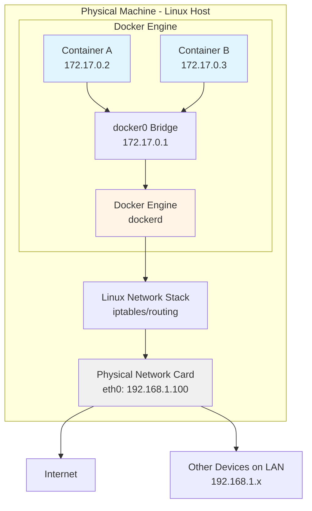

**Key Points:**
- Docker Engine runs directly on Linux
- Containers connect via docker0 bridge
- Network stack is in the kernel (fast)
- Physical NIC has real IP (192.168.1.100) accessible on LAN
- Direct path from containers to internet

---

## Diagram 2: Docker Desktop Architecture Overview

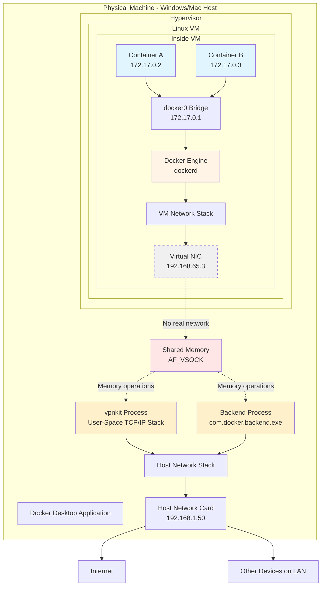

**Key Points:**
- Docker Engine runs inside isolated VM
- VM has private IP (192.168.65.3) not routable outside
- No traditional network between VM and host
- Shared memory used for all host-VM communication
- vpnkit proxies all internet traffic

---

## Diagram 3: Container-to-Container Communication (Same Host)

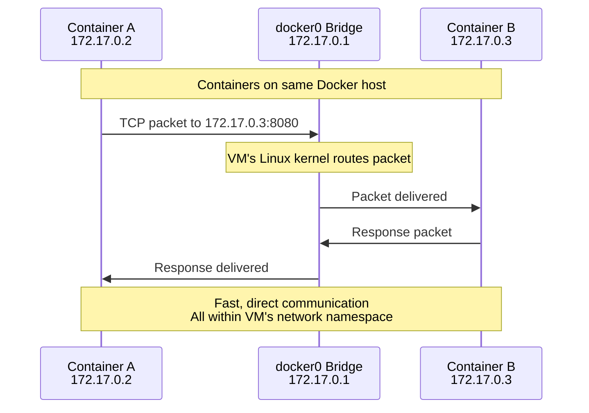

**Key Points:**
- Happens entirely inside the VM
- Uses VM's Linux kernel networking
- No shared memory or vpnkit involved
- Fast and efficient
- Works identically in Docker Desktop and native Linux Docker

---

## Diagram 4: Published Port - Inbound Traffic Flow

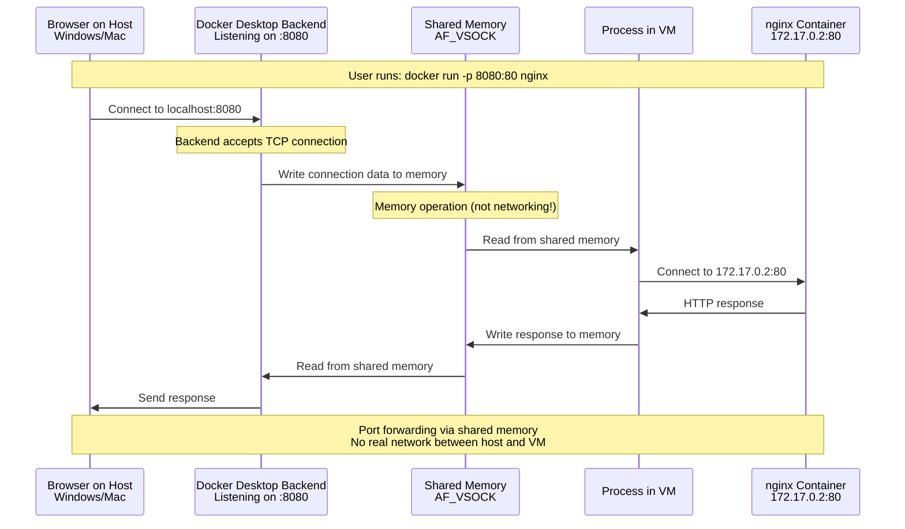

**Key Points:**
- Backend process on host listens on port 8080
- Connection forwarded through shared memory (not network)
- VM process makes separate connection to container
- Bidirectional data copying
- Works for accessing containers from host

---

## Diagram 5: Container Outbound Traffic (Accessing Internet)

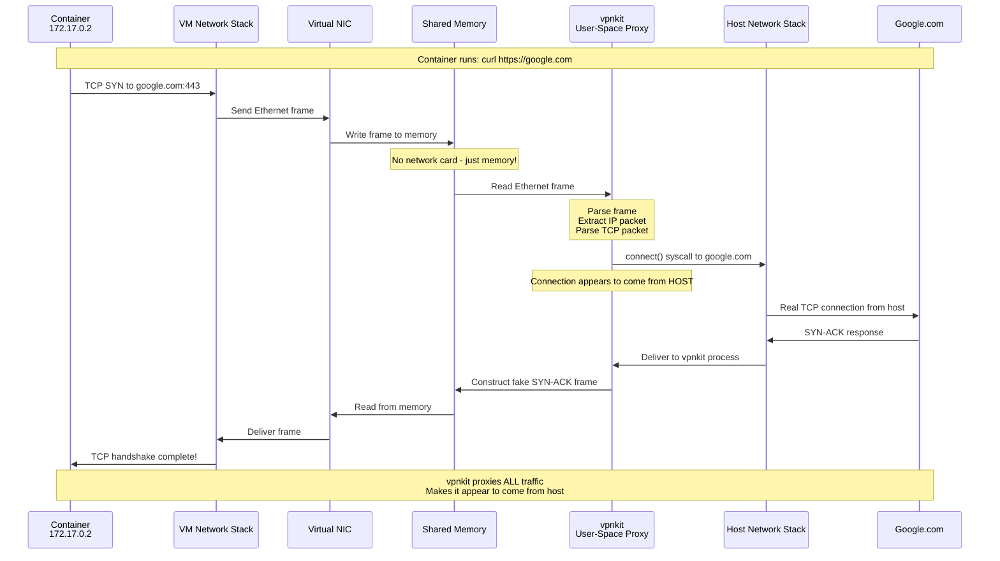

**Key Points:**
- Container thinks it's using normal networking
- All traffic goes through shared memory to vpnkit
- vpnkit makes real connections from host
- VPN/firewall sees traffic from host, not VM
- Response path is reversed

---

## Diagram 6: Multi-Node Swarm - What It Needs

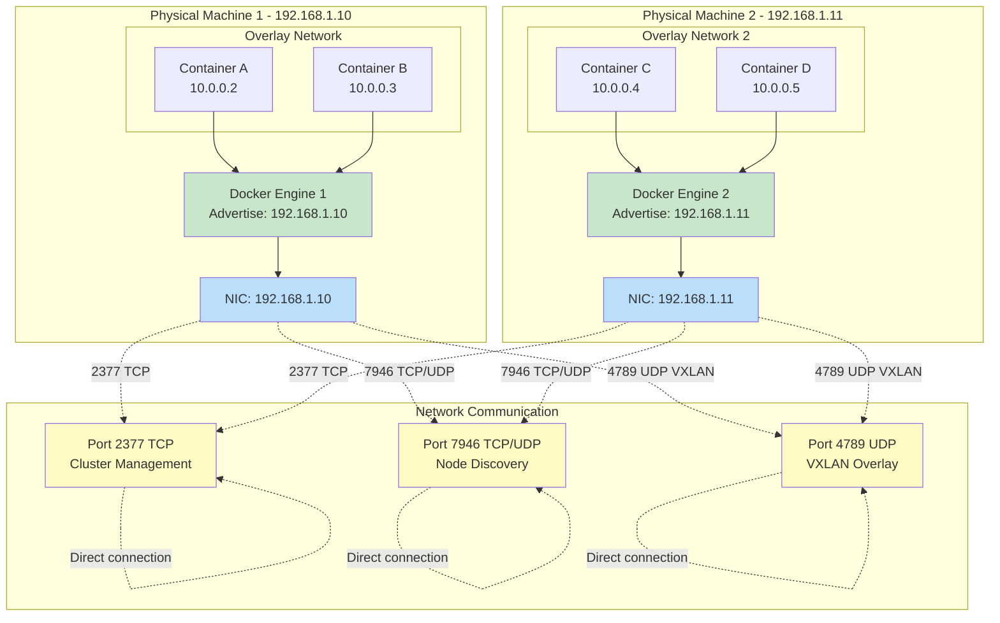

**Requirements:**
- Multiple separate Docker Engine instances
- Each engine has routable IP (192.168.1.10, 192.168.1.11)
- Direct network connectivity between machines
- Open ports 2377, 7946, 4789
- VXLAN encapsulation for overlay networks

---

## Diagram 7: Docker Desktop - Why Multi-Node Swarm Fails (Problem 1)

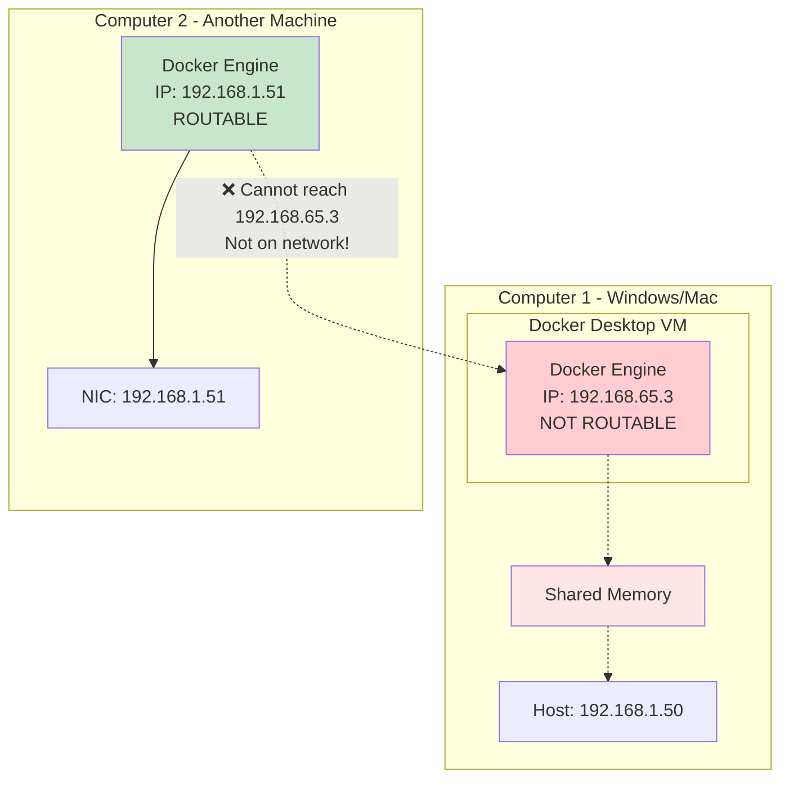

**Problem:** Docker Desktop VM's IP (192.168.65.3) is not routable. Other machines cannot send packets to it.

---

## Diagram 8: Docker Desktop - Why Multi-Node Swarm Fails (Problem 2)

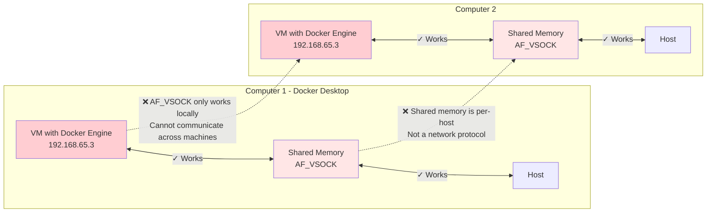

**Problem:** AF_VSOCK (shared memory) only works between VM and its host. Two VMs on different computers cannot use shared memory.

---

## Diagram 9: Docker Desktop - Why Multi-Node Swarm Fails (Problem 3)

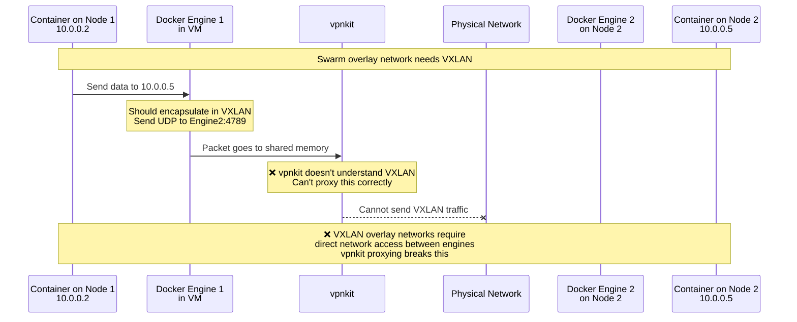

**Problem:** Swarm overlay networks use VXLAN (UDP port 4789). vpnkit cannot proxy VXLAN correctly - it needs direct network access.

---

## Diagram 10: Docker Desktop - Why Multi-Node Swarm Fails (Problem 4)

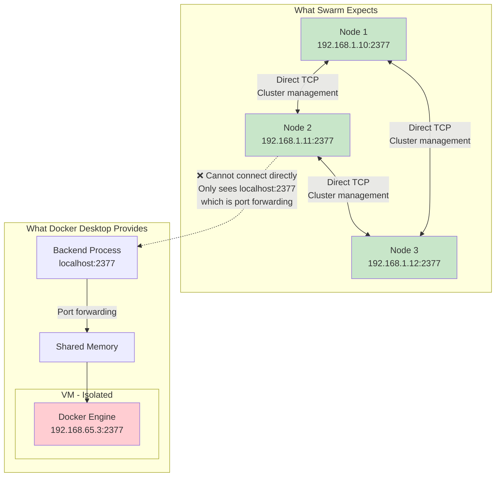

**Problem:** Even with port publishing, other nodes can't connect properly. Swarm expects direct connection to Docker Engine, not forwarding through a proxy.

---

## Diagram 11: Single-Node Swarm on Docker Desktop (What Works)

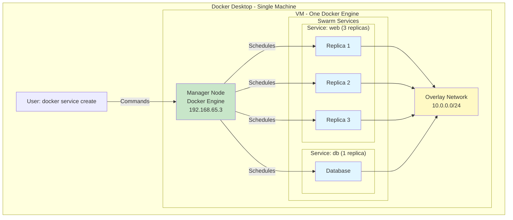

**What Works:**
- Initialize swarm: `docker swarm init`
- Create services with multiple replicas
- Overlay networks work (within single VM)
- Service discovery works
- Rolling updates work
- Everything runs on ONE node

**What Doesn't Work:**
- Cannot add worker nodes
- No high availability (if VM crashes, everything stops)
- Cannot distribute load across machines

---

## Diagram 12: Comparison - Native Linux vs Docker Desktop

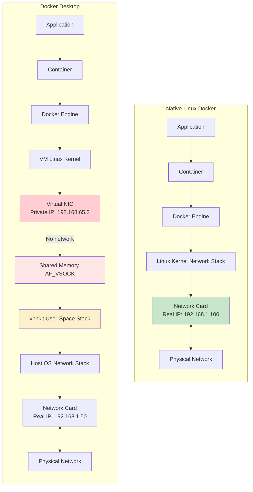

**Key Differences:**
- **Linux**: Direct kernel path, real network card with routable IP
- **Docker Desktop**: VM isolation, shared memory, vpnkit proxy, no routable VM IP

---

## Diagram 13: WSL2 Backend vs Hyper-V Backend (Same Networking!)

```mermaid
graph TB
    subgraph "Hyper-V Backend"
        HV_Host[Windows Host]
        subgraph "Hyper-V"
            HV_VM[DockerDesktopVM<br/>Single VM]
            HV_Engine[Docker Engine]
        end
        HV_SharedMem[AF_VSOCK<br/>Shared Memory]
        HV_VPNKit[vpnkit]
        
        HV_Engine --> HV_VM
        HV_VM <--> HV_SharedMem
        HV_SharedMem <--> HV_VPNKit
        HV_VPNKit --> HV_Host
    end
    
    subgraph "WSL2 Backend"
        WSL_Host[Windows Host]
        subgraph "WSL2"
            WSL_Docker[docker-desktop<br/>Distribution]
            WSL_Data[docker-desktop-data<br/>Distribution]
            WSL_Engine[Docker Engine]
        end
        WSL_SharedMem[AF_VSOCK<br/>Shared Memory]
        WSL_VPNKit[vpnkit]
        
        WSL_Engine --> WSL_Docker
        WSL_Data -.->|Storage| WSL_Docker
        WSL_Docker <--> WSL_SharedMem
        WSL_SharedMem <--> WSL_VPNKit
        WSL_VPNKit --> WSL_Host
    end
    
    Note1[Different VM Technology]
    Note2[SAME Networking Architecture]
    
    style HV_SharedMem fill:#ffe6e6
    style WSL_SharedMem fill:#ffe6e6
    style HV_VPNKit fill:#fff0cc
    style WSL_VPNKit fill:#fff0cc
    style Note2 fill:#c8e6c9
```

**Key Points:**
- Different VM hosting (Hyper-V vs WSL2)
- Same AF_VSOCK shared memory
- Same vpnkit proxying
- Same networking limitations
- Same inability to run multi-node swarm

---

## Diagram 14: The Fundamental Architectural Mismatch

```mermaid
graph LR
    subgraph "Swarm's Expectation"
        direction TB
        SE1[Independent<br/>Docker Engine 1]
        SE2[Independent<br/>Docker Engine 2]
        SE3[Independent<br/>Docker Engine 3]
        SNetwork[Real Network<br/>Direct communication<br/>Routable IPs]
        
        SE1 <--> SNetwork
        SE2 <--> SNetwork
        SE3 <--> SNetwork
        
        style SE1 fill:#c8e6c9
        style SE2 fill:#c8e6c9
        style SE3 fill:#c8e6c9
        style SNetwork fill:#bbdefb
    end
    
    subgraph "Docker Desktop's Reality"
        direction TB
        DE[Single Docker Engine<br/>in Isolated VM]
        DMem[Shared Memory<br/>Host-Local Only]
        DProxy[vpnkit Proxy<br/>User-Space]
        
        DE --> DMem
        DMem --> DProxy
        
        style DE fill:#ffcdd2
        style DMem fill:#ffe6e6
        style DProxy fill:#fff0cc
    end
    
    Mismatch[❌ FUNDAMENTAL MISMATCH<br/>Distributed system vs<br/>Isolated single-node system]
    
    Swarm's Expectation -.-> Mismatch
    Docker Desktop's Reality -.-> Mismatch
    
    style Mismatch fill:#f44336,color:#fff
```

**Summary:**
- Swarm needs: Multiple engines, real networking, direct communication
- Docker Desktop provides: Single engine, memory-based communication, proxy for external access
- These architectures are fundamentally incompatible

---

## Quick Reference: What Each Component Does

| Component | Purpose | Works Across Machines? |
|-----------|---------|----------------------|
| **AF_VSOCK** | Shared memory communication between VM and host | ❌ No - host-local only |
| **vpnkit** | User-space proxy for internet access | ❌ No - proxies outbound only |
| **Port Publishing** | Forward host ports to containers | ❌ No - forwarding, not real network |
| **docker0 Bridge** | Container networking within VM | ❌ No - exists only in VM |
| **Overlay Network** | Multi-host container networking | ❌ Not in Docker Desktop |
| **VXLAN (port 4789)** | Encapsulation for overlay networks | ❌ Requires direct network access |
| **Swarm Management (port 2377)** | Cluster orchestration | ❌ Needs routable Docker Engine IP |
| **Node Discovery (port 7946)** | Cluster membership | ❌ Needs direct node-to-node communication |

---

## The Complete Picture

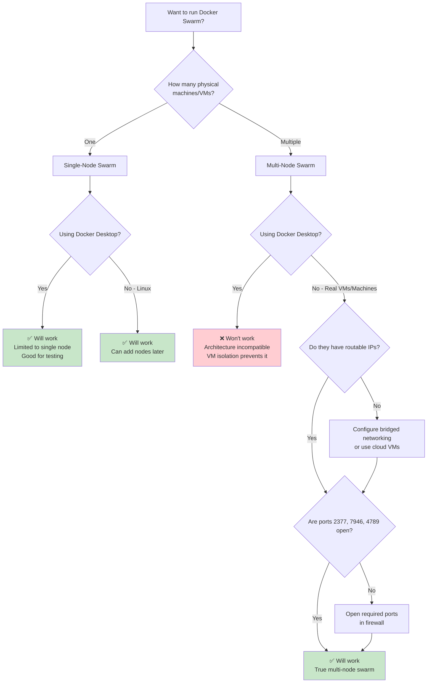

---

## Summary

These diagrams show:

1. **How traditional Docker works** - direct kernel networking
2. **Docker Desktop's architecture** - VM + shared memory + vpnkit
3. **Container-to-container communication** - works within VM
4. **Port publishing** - forwarding through shared memory
5. **Outbound traffic** - proxied through vpnkit
6. **What multi-node swarm needs** - direct network access
7. **Why Docker Desktop can't do it** - four fundamental problems
8. **What works** - single-node swarm for testing
9. **WSL2 vs Hyper-V** - same networking architecture
10. **The fundamental mismatch** - distributed vs isolated architecture

The core issue: Docker Swarm needs a distributed system with real networking. Docker Desktop provides an isolated single-node system with memory-based communication.
